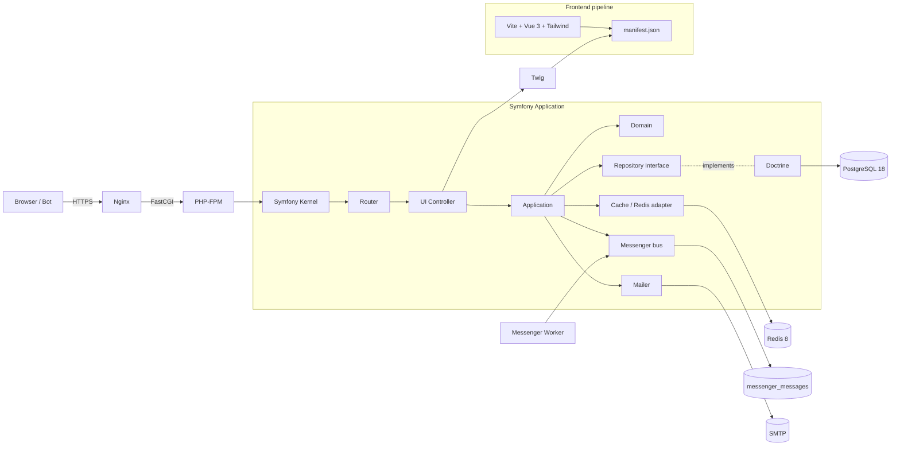
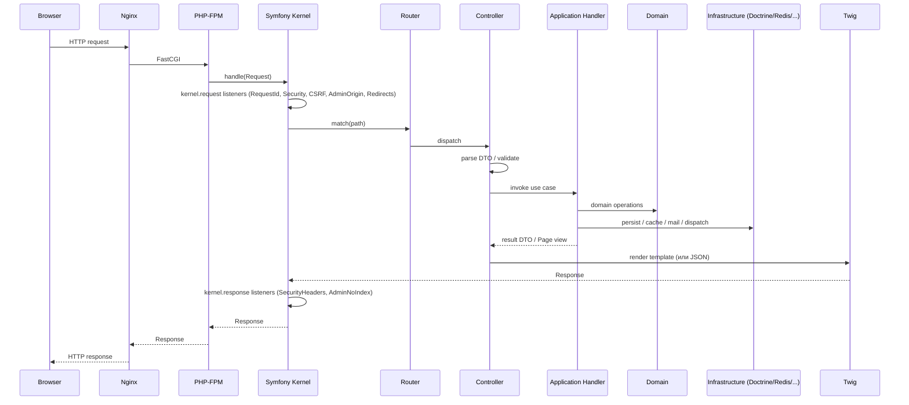
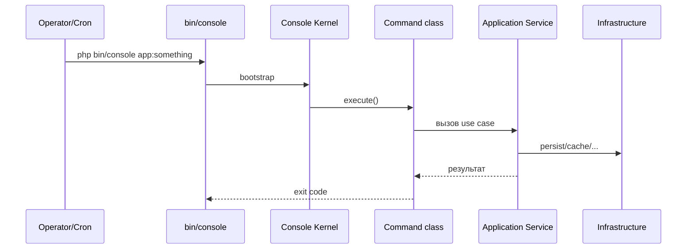
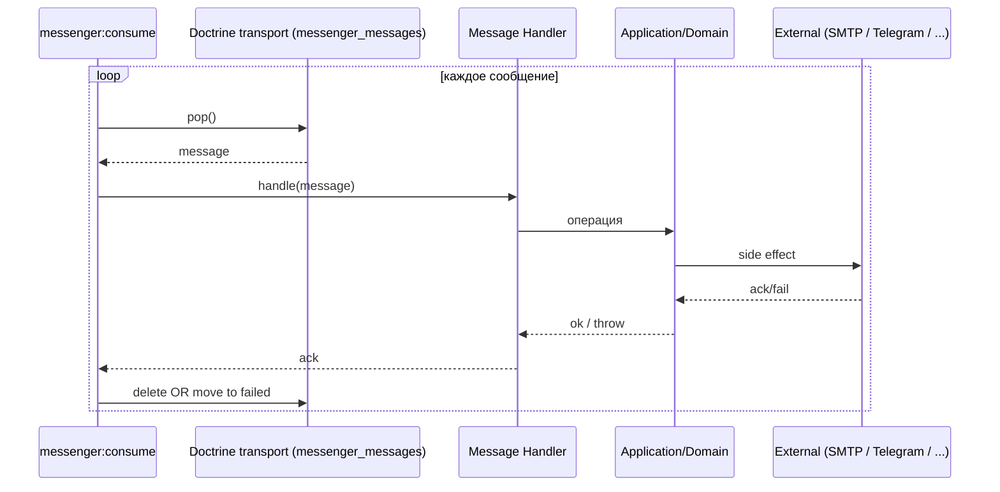
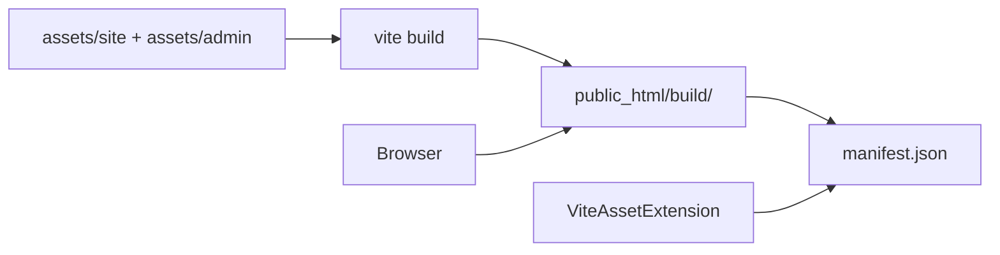
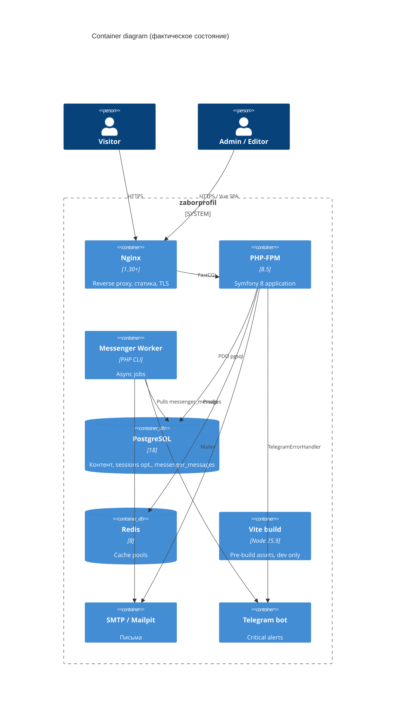
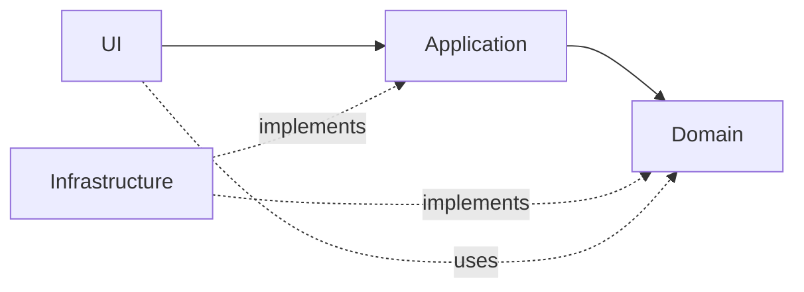
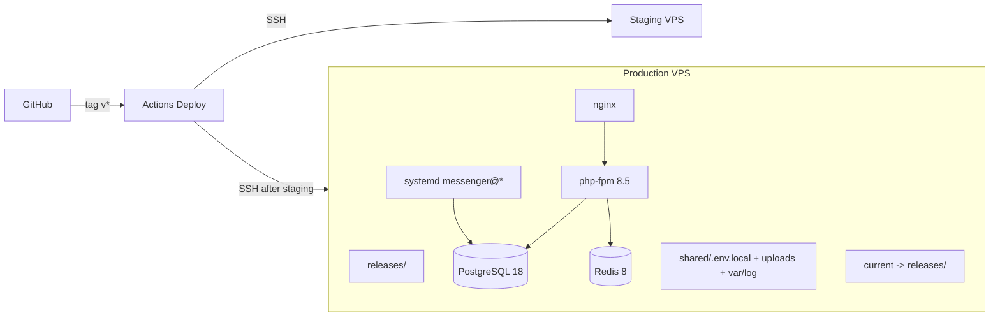

# 02. Высокоуровневая архитектура

## Стиль архитектуры

Проект построен как **Modular Monolith с Clean Architecture внутри каждого модуля**.

- Один Symfony-приложение, один deployment unit.
- Внутри `src/Module/<Name>` — четыре слоя: `Domain`, `Application`, `Infrastructure`, `UI`.
- `src/Shared` — утилиты, контракты, инфраструктурные адаптеры, общий UI.
- Жёсткое направление зависимостей: `UI -> Application -> Domain <- Infrastructure`.

## High-level diagram



## Lifecycle: HTTP request

См. подробно в [07-request-flow](07-request-flow.md).



## Lifecycle: console command



## Lifecycle: Messenger worker

См. подробно в [24-messenger-and-queues](24-messenger-and-queues.md).



## Lifecycle: frontend assets



## Слои

| Слой | Где живёт | Роль | Можно ли зависеть от Symfony/Doctrine |
|---|---|---|---|
| Presentation (Twig templates) | `templates/` | SSR разметка | Только Twig API |
| Controller / UI | `src/Module/*/UI`, `src/Shared/UI` | Вход HTTP/CLI, парсинг DTO | Да, Symfony HTTP Foundation |
| Application | `src/Module/*/Application` | Use cases, command/query, DTO, оркестрация | Только PHP/Symfony Validator/PSR; **не** Request/Response/EntityManager |
| Domain | `src/Module/*/Domain`, `src/Shared/Domain` | Сущности, value objects, инварианты, repository interfaces | Только PHP. Допустимы Doctrine attributes на Entity, но без вызова EM |
| Infrastructure | `src/Module/*/Infrastructure`, `src/Shared/Infrastructure` | Реализации интерфейсов: Doctrine, Redis, Mailer, FileStorage | Да |
| Persistence | `src/**/Infrastructure/Doctrine` | Doctrine repos / listeners | Да |
| Integration | `src/**/Infrastructure/Integration` (целевое) | HTTP-клиенты, внешние API | Да |
| Deployment | `tools/deploy/`, `docker/`, `.github/workflows/` | Поставка приложения | n/a |

Подробные правила — [04-layer-rules](04-layer-rules.md).

## Container diagram



## Направление зависимостей



- Стрелка `-->` — `requires`.
- Стрелка `-.implements.->` — реализует контракт.
- Domain **никогда** не импортирует Symfony, Doctrine, Twig, Predis, FS.

## Разделение зон Front / Admin / API / Dev

```mermaid
flowchart LR
    Public[/Public site/] --> FrontControllers[UI/Web controllers]
    AdminUI[/admin UI shell/] --> AdminControllers[UI/Admin/* HTML]
    AdminAPI[/admin/api/*/] --> AdminApiControllers[UI/Admin/* JSON]
    DevTools[/_(profiler|wdt)/] --> Symfony[dev-only bundles]

    FrontControllers -.no admin auth.- Application
    AdminControllers --> Firewall[Symfony firewall main]
    AdminApiControllers --> Firewall
    Firewall --> AdminPermissionVoter
    DevTools --> DevOnly[only APP_ENV=dev/test]
```

Правила:

- `^/admin/api` — JSON, требует CSRF + same-origin Origin/Referer.
- `^/admin` — HTML admin, requires `ROLE_ADMIN`.
- Front catch-all (`PublicPageController`) — приоритет `-100`, чтобы не перехватывать admin/API.
- Dev-route не должно быть на production окружении (`when@dev` в bundles.php).

См. [12-admin-area](12-admin-area.md), [13-front-area](13-front-area.md), [14-api-area](14-api-area.md), [15-dev-area](15-dev-area.md).

## Deployment diagram (target)



## Где живёт бизнес-логика

| Должна жить | Не должна жить |
|---|---|
| `Domain/Entity` (rich behaviour, инварианты) | `Controller` — никогда |
| `Domain/Service` (вычисления без I/O) | `Twig` — никогда |
| `Application/Handler` (оркестрация транзакций, событий, side effects) | `EventSubscriber` (кроме инфраструктурных subscriber’ов: security headers, request_id, admin csrf) |
| `Domain/ValueObject` (валидируемые value typing) | `Repository` — это адаптер, не бизнес-логика |
|  | `Migration` — миграция меняет только схему/данные, не вызывает Domain |

## Почему контроллер тонкий

- Контроллер — это адаптер транспорта (HTTP, CLI). Он знает Request/Response, но **не** знает бизнес-инвариантов.
- Тонкий контроллер легко тестируется functional-тестом, его легко переключить с HTML на API без переписывания логики.
- Толстый контроллер блокирует переиспользование use case (например, тот же CreatePage из CLI или из messenger).

## Почему Entity не может быть god object

- God-entity нарушает SRP: смешивает persistence, бизнес-правила, отрисовку, валидацию, integration calls.
- Симптом god-entity: 30+ методов, getter/setter на всё, 5+ зависимостей в конструкторе, ссылки на Symfony/Twig.
- В проекте Entity = маленькое, валидирует своих инварианты в конструкторе/методах. См. [Page](../src/Module/Content/Domain/Entity/Page.php).

## Почему Service layer должен быть осмысленным

Запрещено делать `App\Service\PageService` со 100 разнотипных методов. Вместо этого — отдельные `Application\Handler\<Action>Handler` или `Application\Service\<Capability>` (например, `PublicPageResolver`, `SettingsRegistry`). Имя сервиса должно отражать **способность**, а не «тут всё про Page».

## Связанные документы

- [03-project-structure](03-project-structure.md)
- [04-layer-rules](04-layer-rules.md)
- [06-module-architecture](06-module-architecture.md)
- [07-request-flow](07-request-flow.md)
