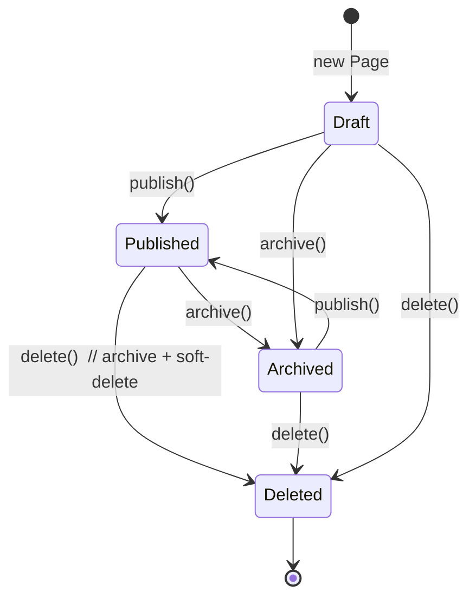
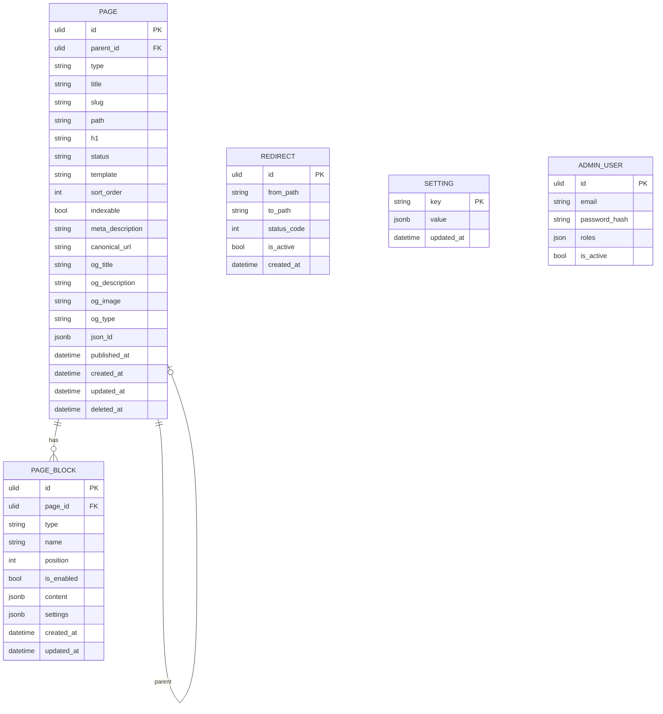
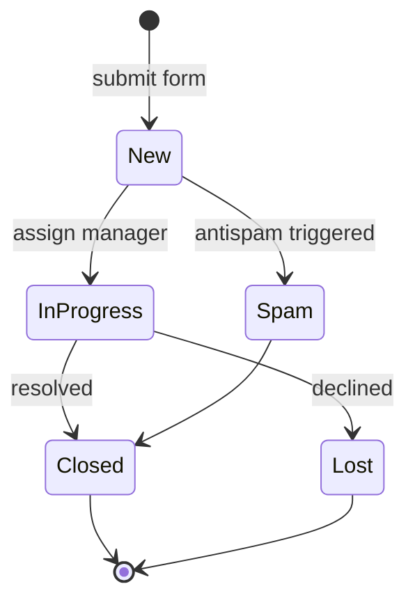
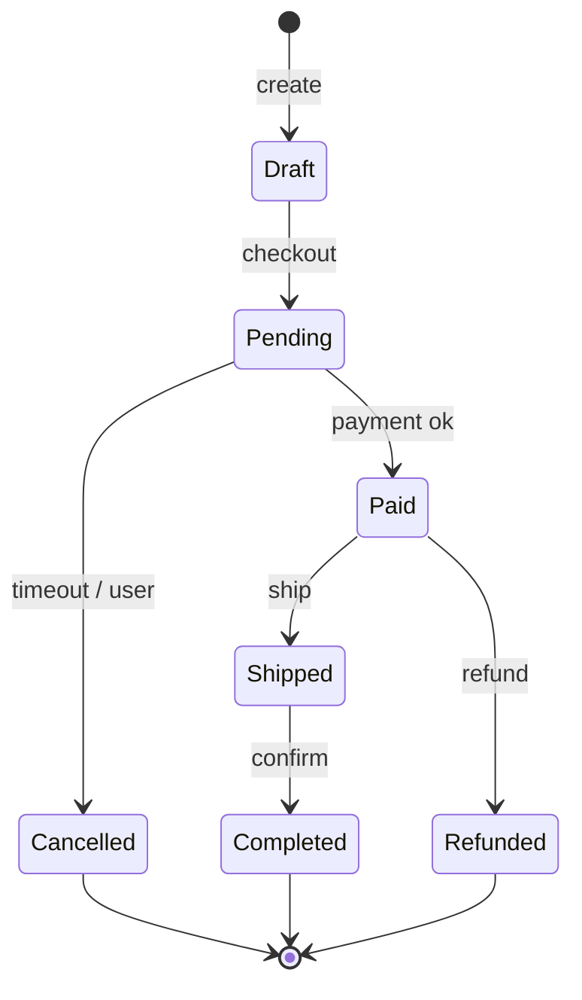
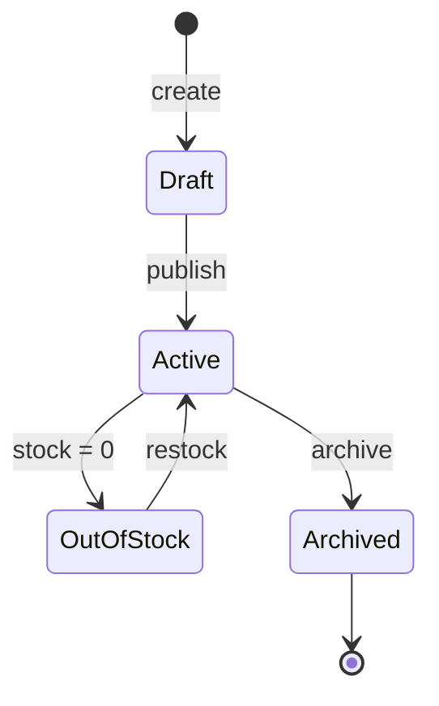

# 05. Доменная модель

Документ описывает фактическую и целевую доменную модель CMS.

## Реализованные сущности

### Page — `src/Module/Content/Domain/Entity/Page.php`

Ключевые поля и инварианты:

| Поле | Тип | Инвариант |
|---|---|---|
| `id` | `Ulid` | генерируется в конструкторе |
| `parent` | `?Page` | `ON DELETE SET NULL` |
| `type` | `PageType` enum | required |
| `title` | `string(255)` | trim, не пусто |
| `slug` | `string(180)` | `^[a-z0-9]+(-[a-z0-9]+)*$` |
| `path` | `string(512)` | начинается с `/`, без `//`, разрешены `[a-z0-9_\-./]` |
| `h1` | `string(255)` | trim, не пусто |
| `status` | `PageStatus` | по умолчанию `Draft` |
| `template` | `string(120)` | по умолчанию `default` |
| `sortOrder` | `int` | для упорядочивания |
| `indexable` | `bool` | по умолчанию `true`; рендерится в `<meta name="robots">` |
| `metaDescription` | `?string(320)` | управляется через `PUT /admin/api/content/pages/{id}/seo` |
| `canonicalUrl` | `?string(2048)` | абсолютный URL; null = автогенерация из `path` |
| `ogTitle` | `?string(255)` | OpenGraph title; null = fallback на `title` |
| `ogDescription` | `?string(320)` | OG description; null = fallback на `metaDescription` |
| `ogImage` | `?string(2048)` | абсолютный URL; null = OG image не рендерится |
| `ogType` | `?string(32)` | null = `'website'` |
| `jsonLd` | `?list<array>` | список Schema.org блоков; каждый требует `@context` и `@type` |
| `publishedAt` | `?DateTimeImmutable` | проставляется в `publish()` |
| `createdAt`/`updatedAt` | `DateTimeImmutable` | через `HasTimestamps`/`TimestampListener` |
| `deletedAt` | `?DateTimeImmutable` | soft delete через `HasSoftDelete` |
| `blocks` | `Collection<PageBlock>` | sorted by `position` |

Жизненный цикл:

Ключевые правила:

- Уникальность `path` среди live (`deleted_at IS NULL`) — поддерживается **partial unique index** (см. `Version20260501000300`). Doctrine attribute не умеет partial — поэтому проверка дубля делается через `PageRepositoryInterface::existsByPath()`.
- Изменение `path` опубликованной страницы должно сопровождаться созданием `Redirect` (на уровне application layer / Seo listener `PagePathChangeListener`).
- Только `Published` отображается публично. `Draft`/`Archived` -> `404`.

### PageBlock — `src/Module/Content/Domain/Entity/PageBlock.php`

| Поле | Тип |
|---|---|
| `id` | `Ulid` |
| `page` | `Page` |
| `type` | `BlockType` enum |
| `name` | `string` |
| `position` | `int` |
| `isEnabled` | `bool` |
| `content` | JSONB |
| `settings` | JSONB |
| `createdAt`/`updatedAt` | timestamps |

Жизненный цикл управляется через application handler (`Create/Update/Delete/Reorder`).

### Setting — `src/Module/Settings/Domain/Entity/Setting.php`

Ключ-значение конфигурации, читаемое через `SettingsService`/`SettingsRegistry` и доступное в Twig через `SettingsTwigExtension`.

### Redirect — `src/Module/Seo/Domain/Entity/Redirect.php`

301/302 правила, обрабатываемые `RedirectKernelSubscriber` на `kernel.request`.

### AdminUser — `src/Module/User/Infrastructure/Doctrine/Entity/AdminUser.php`

Symfony Security user. Лежит в `Infrastructure/Doctrine/Entity/`, потому что это persistence model (а не богатая Domain Entity), и автоматически участвует в DI исключается из автозагрузки.

### Domain enums

- `PageStatus`: `Draft`, `Published`, `Archived`.
- `PageType`: типы страниц (landing, content и т.п.).
- `BlockType`: типы блоков (`hero`, `text`, `seo_text`, `default`).
- `AdminPermission`: `pages.view`, `pages.create`, `pages.edit`, `pages.publish`, `pages.delete`, `seo.edit`, `media.upload`, `media.delete`, `leads.view`, `leads.manage`, `settings.edit`, `users.manage`, `system.view`, `system.manage`.

## ER-диаграмма (фактическое состояние)

## Целевая доменная модель

Зарезервированы будущие модули. Ниже — ожидаемые сущности и их роль.

| Сущность | Модуль | Роль |
|---|---|---|
| `Menu`, `MenuItem` | `Menu` | Управляемые меню для разных позиций |
| `MediaAsset` | `Media` | Файл с метаданными, превью, варианты |
| `SeoMetadata` | `Seo` или embedded в `Page` | Title/Description/Canonical/Robots/JSON-LD |
| `SitemapEntry` | `Seo` | Динамические записи в sitemap |
| `Lead`, `FormRequest` | `Lead` | Заявка с антиспам-проверками |
| `LandingPage` | подтип `Page` или `PageType::Landing` | Лендинги |
| `Category`, `Product`, `ProductVariant` | `Catalog` | Каталог |
| `Cart`, `Order`, `OrderItem` | `Order` | Заказы |
| `Customer` | `User` (или отдельный) | B2C-клиент |
| `Partner` | `Partner` | B2B-партнёр |
| `Role`, `Permission` | `Auth` | Сейчас — захардкоженные enum, target — настраиваемые |
| `AuditLog` | `AuditLog` | Логи критичных действий (publish, role change, settings update) |
| `Redirect` | `Seo` | Уже реализовано |

### State diagrams (целевые)

#### Lead

#### Order

#### Product

## Что Entity, что Value Object

| Концепт | Тип | Почему |
|---|---|---|
| `Page` | Entity | Имеет идентичность (`id`), эволюционирует во времени |
| `PageBlock` | Entity | Идентичность, упорядочивание |
| `Slug` | Value Object (целевое) | Сейчас `string` с валидацией в Entity. При появлении другого использования — выделить VO |
| `Path` | Value Object (целевое) | То же, что `Slug` |
| `EmailAddress` | Value Object (целевое) | Когда появятся Lead/Customer |
| `Money` | Value Object (целевое) | Для каталога/заказов |
| `SeoMetadata` | Embedded VO (целевое) | Поля title/description/canonical как один immutable объект |

## Что не должно попасть в Entity

- HTTP Request/Response.
- Twig Environment.
- Filesystem операции.
- Внешние HTTP клиенты.
- Symfony Mailer.
- Symfony Cache.
- Doctrine `EntityManager` вызовы (только attributes).
- Бизнес-логика, требующая нескольких aggregates — это **Application/Domain Service**.

## Anti-patterns

- **God-entity** на 800 строк, делает «всё про Page».
- **Anemic-entity** с одними setter’ами, без правил — превращает домен в DTO.
- **Validation на Entity через Symfony Validator constraints** — мешает persistence и business rules. Constraints живут на DTO.
- **Сложные коллекции через `findAll()` + filter в PHP** — ломает производительность; писать репозиторный метод.
- **Прямое мутирование `private` через рефлексию** — грубое нарушение инкапсуляции.

## Связанные документы

- [10-domain-layer](10-domain-layer.md)
- [17-doctrine-and-database](17-doctrine-and-database.md)
- [09-application-layer](09-application-layer.md)
