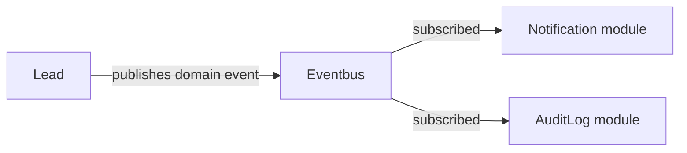

# 06. Модульная архитектура

## Что такое модуль

Модуль — это **bounded context** в терминах DDD: смысловая зона домена с внутренними слоями `Domain/Application/Infrastructure/UI`. Один модуль = одна папка `src/Module/<Name>`.

## Карта модулей

| Модуль | Реализован | Назначение |
|---|---|---|
| `Admin` | да | Admin shell, dashboard, системные разделы (здоровье, логи, очереди, кэш, деплой, бэкапы, сборка фронтенда), CSRF/Origin/NoIndex/exception subscriber’ы |
| `Auth` | да | Логин админа, voter `AdminPermissionVoter`, `AdminUserChecker`, enum `AdminPermission` |
| `User` | да | `AdminUser` Doctrine entity, `AdminUserRepository`, управление пользователями |
| `Content` | да | `Page`, `PageBlock`, ревизии и публикация, конструктор, Admin API, публичный SSR-рендер |
| `Seo` | да | `Redirect`, журнал 404, `SitemapController`, `RobotsController`, `PagePathChangeListener`, SEO-проверки перед публикацией |
| `Settings` | да | Settings registry/service, Twig extension, веб-запуск миграций |
| `Media` | да | Медиатека, безопасные uploads, варианты изображений, учёт использования |
| `Menu` | да | Управляемые меню, хлебные крошки |
| `Lead` | да | Заявки: публичная форма, CRM в админке |
| `AuditLog` | да | Журнал критичных действий |
| `Catalog` | да | Категории, товары, варианты; публичный каталог |
| `Portfolio` | зарезервировано (только README) | Портфолио проектов |
| `Redirect` | зарезервировано (только README) | Если редиректы вырастут в самостоятельный домен (сейчас — в `Seo`) |
| `Order`/`Partner` | зарезервировано (только README) | E-commerce/B2B |

## Внутренняя структура модуля

```text
src/Module/<Name>/
├── Domain/
│   ├── Entity/
│   ├── ValueObject/        (по необходимости)
│   ├── Enum/
│   ├── Event/              (по необходимости)
│   ├── Exception/
│   ├── Repository/         (interfaces)
│   └── Service/            (доменные сервисы без I/O)
├── Application/
│   ├── Command/            (input DTO для use case)
│   ├── Query/              (read DTO)
│   ├── Handler/            (CreateXHandler, UpdateXHandler)
│   ├── DTO/                (output DTO)
│   ├── Service/            (resolver/registry уровня application)
│   └── Exception/          (по необходимости)
├── Infrastructure/
│   ├── Doctrine/           (listeners, ORM mappings, naming)
│   ├── Repository/         (Doctrine implementations)
│   ├── Http/               (event subscribers модуля)
│   └── Security/           (voters, user checkers)
├── UI/
│   ├── Admin/              (admin HTML и admin API)
│   ├── Web/                (публичные контроллеры/renderers)
│   ├── Api/                (публичные API, по необходимости)
│   └── Twig/               (Twig extensions)
└── README.md
```

Не каждая подпапка обязательна. Создавайте только то, что реально нужно сейчас.

## Как модуль общается с другими

Через **Published Language** — публичный контракт:

- `*RepositoryInterface` (для чтения) — допустимо использовать из других модулей **только если** интерфейс намеренно опубликован.
- Application-handler как точка входа (хоть из console, хоть из messenger).
- Domain Event (целевое, через Symfony EventDispatcher).
- Не обращаться к чужому `Doctrine*Repository` напрямую.
- Не импортировать чужие Entity для записи (только для чтения, и то лучше через DTO).

### Целевая схема общения


```mermaid
flowchart LR
    Lead -->|publishes domain event| Eventbus
    Eventbus -->|subscribed| Notifier[Notification module]
    Eventbus -->|subscribed| Audit[AuditLog module]
```

## Циклические зависимости

Новые циклы запрещены. Если модуль A нуждается в данных модуля B и наоборот, это означает:

1. Либо смешаны bounded contexts (нужно перепроектировать);
2. Либо общий концепт нужно вынести в `Shared`;
3. Либо общение должно идти через события, а не прямые вызовы.

### Фактический граф и известные циклы

Направление зависимостей проверяет `tests/Unit/Architecture/ModuleDependencyTest.php`: он сканирует `src/` на ссылки `App\Module\<X>\…` и сверяет их со списком `ALLOWED`. Тест падает, если:

- `src/Shared` ссылается на любой модуль;
- появилась зависимость, которой нет в списке (нужна — добавить в `ALLOWED` и в таблицу ниже осознанно, в том же PR);
- зависимость из списка исчезла (убрать её из `ALLOWED` и таблицы, чтобы она не вернулась незаметно);
- появился цикл, которого нет в `KNOWN_CYCLES`.

| Модуль | Зависит от |
|---|---|
| `Admin` | AuditLog, Auth, User |
| `AuditLog` | Auth, Content, Seo, Settings, User |
| `Auth` | User |
| `Catalog` | Auth, Media, Seo |
| `Content` | Auth, Media, Menu, Seo, Settings, User |
| `Lead` | Admin, Auth, Content, User |
| `Media` | Auth, Content |
| `Menu` | Auth, Content, Media |
| `Seo` | Auth, Catalog, Content, Settings |
| `Settings` | Admin, Auth, Content, Media, User |
| `User` | Auth |

Существующие циклы и их причина. Разбирать их сейчас не требуется — только если начнут мешать изменениям:

| Цикл | Откуда |
|---|---|
| Auth ↔ User | `AdminUserChecker` читает `AdminUser`; `UserApiController` проверяет `AdminPermission` |
| Catalog ↔ Seo | каталог использует `SchemaOrgBuilder`/`CanonicalUrlGuard`; sitemap читает товары |
| Content ↔ Media | Content публикует `MediaUsageProviderInterface`; Media использует `ContentNotFoundException` |
| Content ↔ Menu | рендер страницы строит хлебные крошки (`BreadcrumbBuilder`); меню читает страницы и сбрасывает их кэш |
| Content ↔ Seo | публикация вызывает SEO-проверки и `SeoTitleResolver`; Seo читает страницы и сбрасывает их кэш |
| Content ↔ Settings | Content читает `SettingsRegistry`; сохранение настроек сбрасывает кэш страниц |

## Что положить в `Shared`, а не в модуль

- Утилиты идентификаторов (`EntityId`).
- Общие traits (`HasTimestamps`, `HasSoftDelete`).
- HTTP-инфраструктуру, общую для всех зон (`RequestIdSubscriber`, `SecurityHeadersSubscriber`).
- Healthcheck, ViteAssetExtension.
- Logging processors, redactor.

`Shared` **не** импортирует `App\Module\*`.

## Как добавить новый модуль

1. Открыть [43-module-development-guide](43-module-development-guide.md).
2. Создать `src/Module/<Name>/` с подпапками по необходимости.
3. Завести `README.md` модуля с целью и публичным контрактом.
4. Если есть Entity — добавить в `services.yaml` исключение из автозагрузки и alias’ы repository interfaces.
5. Если есть admin API — повесить под `/admin/api/<module>/...`, проверить voter и CSRF.
6. Добавить миграцию.
7. Добавить тесты (unit + integration минимум).
8. Добавить зависимости модуля в `ModuleDependencyTest::ALLOWED` и в таблицу «Фактический граф» выше.
9. Обновить [05-domain-model](05-domain-model.md), [03-project-structure](03-project-structure.md), [00-overview](00-overview.md), [48-documentation-normalization](48-documentation-normalization.md) при изменении карты legacy->NN.

## Как удалить модуль

1. Найти все ссылки (`rg "App\\\\Module\\\\<Name>" -t php`).
2. Перенести/выпилить функциональность.
3. Создать миграцию для удаления таблиц **через staged migration** (см. [18-migrations](18-migrations.md)): сначала миграция, делающая поля nullable / сносящая FK, потом релиз с удалением кода, потом миграция drop table.
4. Удалить `src/Module/<Name>`, шаблоны, тесты, документацию.
5. Обновить [48-documentation-normalization](48-documentation-normalization.md), если меняется карта переходных документов.

## Документирование модуля

Каждый модуль обязан иметь `README.md`:

- зачем модуль существует;
- какие Entity/Aggregate он владеет;
- какие интерфейсы публикует наружу;
- какие admin/public роуты предоставляет;
- какие миграции относятся к модулю;
- какие тесты покрывают модуль;
- какие риски/ограничения.

## Тестирование модуля

- **Unit:** Domain entities, enums, domain services, value objects.
- **Integration:** репозитории на тестовой БД (миграции применяются).
- **Functional:** контроллеры (админ-API + публичные).
- **Smoke:** healthcheck/sitemap/robots.

См. [31-testing-strategy](31-testing-strategy.md).

## Связанные документы

- [03-project-structure](03-project-structure.md)
- [04-layer-rules](04-layer-rules.md)
- [43-module-development-guide](43-module-development-guide.md)
