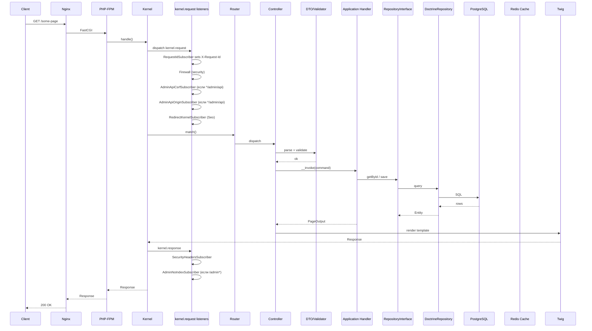
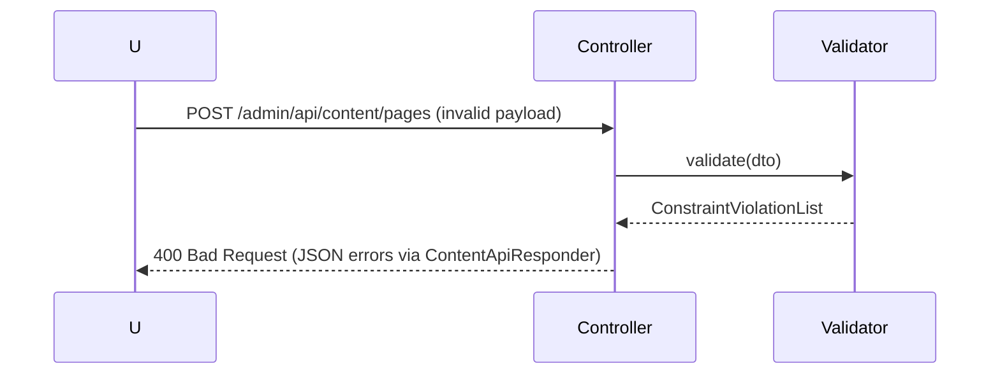
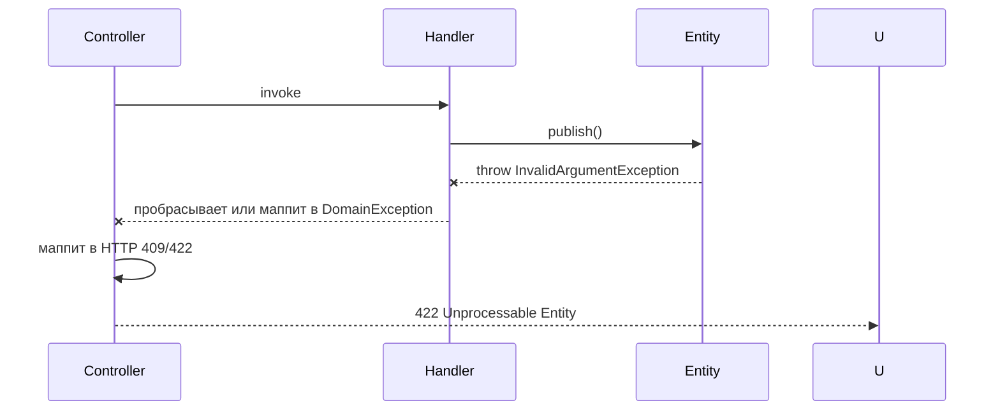
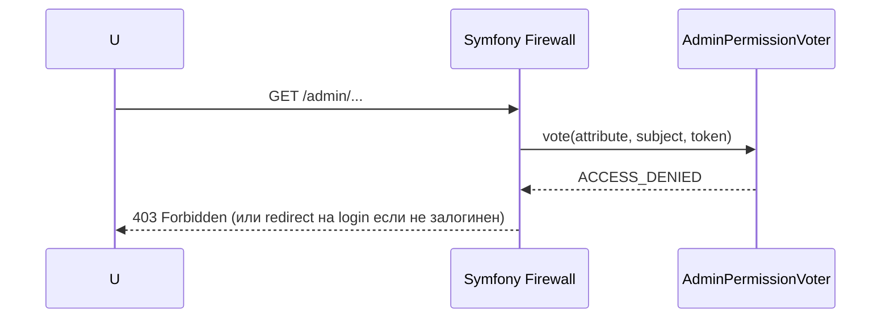
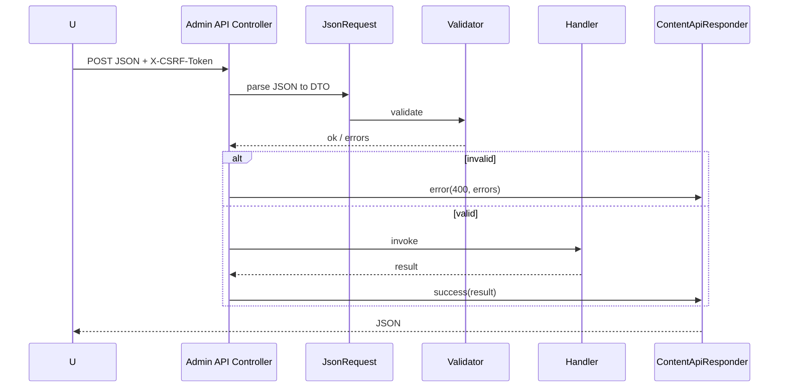
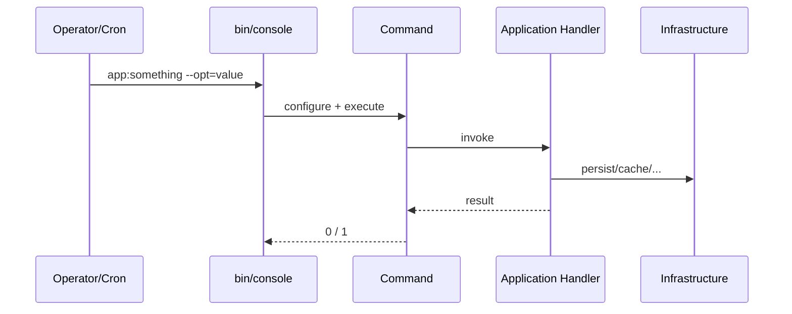
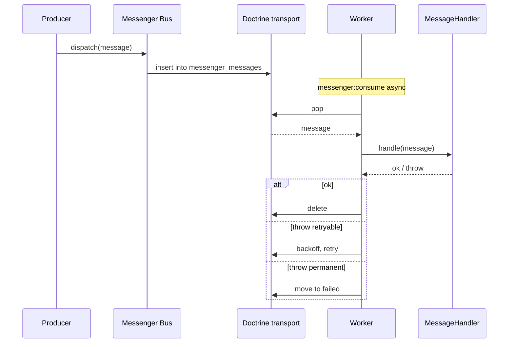

# 07. Request flow

Подробное описание пути запроса в системе.

## HTTP request — happy path

## Validation failure

`Application` не должен запускаться при невалидном вводе. Контракт DTO — валидация **до** вызова handler.

## Domain error

Domain exceptions не утекают как 500. Они конвертируются в осмысленный HTTP-код в контроллере или централизованном responder’е.

## Infrastructure error

Доступы к Redis/SMTP/Telegram не должны валить запрос пользователя без оснований. Стратегия по умолчанию:

- Cache недоступен — fallback на прямое чтение из БД, лог `cache.error`.
- SMTP недоступен — отправка через Messenger, retry с backoff.
- Telegram недоступен — лог критики не теряется (попадает в основной handler).
- БД недоступна — 503 + healthcheck показывает `not ready`.

## Not found

`PublicPageController` бросает `createNotFoundException()` при отсутствии страницы или статусе `Draft/Archived`. Symfony возвращает 404, рендерит `templates/bundles/TwigBundle/Exception/error404.html.twig` (целевое).

## Access denied

## Form submission (admin)

Большинство admin-операций идёт через JSON API; FormType используется только для login-формы и других чисто HTML-форм.

## API request

Идентичен admin API, но:

- роуты под `/api/...` (целевое);
- авторизация через токен/JWT (целевое);
- без CSRF, но с rate-limiting и Origin checks для CORS.

## Console command

Console command — тонкий контроллер для CLI: парсит ввод, вызывает handler, печатает результат.

## Async message (Messenger)

См. [24-messenger-and-queues](24-messenger-and-queues.md).

## Lifecycle событий Symfony, которые мы используем

| Событие | Где | Что делает |
|---|---|---|
| `kernel.request` | `RequestIdSubscriber` | Назначает `X-Request-Id` |
| `kernel.request` | Symfony Security Firewall | Auth |
| `kernel.request` | `AdminApiCsrfSubscriber` | CSRF для `^/admin/api` |
| `kernel.request` | `AdminApiOriginSubscriber` | Same-origin Origin/Referer |
| `kernel.request` | `RedirectKernelSubscriber` | 301/302 для `Redirect` |
| `kernel.controller` | (не используется) | резерв для DTO mapping |
| `kernel.exception` | (целевое) | централизованный JSON error для API |
| `kernel.response` | `SecurityHeadersSubscriber` | заголовки `X-Frame-Options` и т.д. |
| `kernel.response` | `AdminNoIndexSubscriber` | `X-Robots-Tag: noindex` для `/admin*` |
| Doctrine `prePersist`/`preUpdate` | `TimestampListener` | created_at/updated_at |
| Doctrine `postUpdate` | `PagePathChangeListener` | реакция на смену `Page.path` |

## Связанные документы

- [02-architecture](02-architecture.md)
- [08-controller-architecture](08-controller-architecture.md)
- [16-routing](16-routing.md)
- [30-error-handling](30-error-handling.md)
