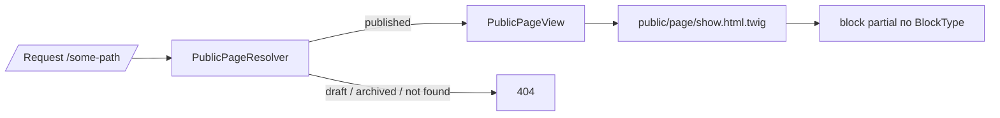

# 13. Front area (публичный сайт)

## Назначение

Публичный сайт `zaborprofil.ru` — SSR через Symfony + Twig. SPA для публичной зоны не используется.

## Маршруты

| Префикс/path | Контроллер | Что |
|---|---|---|
| `/` | `Module\Content\UI\Web\PublicPageController` через `Page.path = '/'` | Главная CMS-страница |
| `/health` | `Shared\UI\Http\HealthCheckController` | Healthcheck |
| `/sitemap.xml` | `Module\Seo\UI\Web\SitemapController` | Sitemap |
| `/robots.txt` | `Module\Seo\UI\Web\RobotsController` | robots.txt |
| `/{path}` (catch-all, priority -100) | `Module\Content\UI\Web\PublicPageController` | Публичные страницы |

`priority: -100` — критично: catch-all не должен перехватывать `admin/*`, `api/*`, sitemap/robots/health.

## Публичный page render



Правила публичного рендера:

- Только `PageStatus::Published`.
- Soft-deleted (с `deletedAt`) — не показывается.
- Блоки сортируются по `position`.
- Блок с `isEnabled=false` пропускается.
- Неизвестный `BlockType` — fallback на `templates/public/blocks/default.html.twig`.

## Layouts и partial’ы

```text
templates/
├── base.html.twig                 # общий layout: head, header, footer
└── public/
    ├── page/show.html.twig        # главный публичный шаблон
    └── blocks/
        ├── default.html.twig      # fallback
        ├── hero.html.twig
        ├── seo_text.html.twig
        └── text.html.twig
```

Любая публичная страница наследуется от `base.html.twig`.

## SEO в Front

См. [26-seo-architecture](26-seo-architecture.md). Кратко.

**Фактическое состояние:**

- `<title>` — `Page.title`.
- `<h1>` — `Page.h1`.
- `<meta name="robots">` — `index, follow` или `noindex, nofollow` на основе `Page.indexable`.
- `<meta name="description">` — `Page.metaDescription` (если задано).
- `<link rel="canonical">` — `Page.canonicalUrl` (если задан) или автогенерация через `absolute_url(page.path)`.
- `og:type/og:title/og:description/og:url/og:image` — из соответствующих полей `Page` с fallback'ами (см. [26-seo-architecture §8](26-seo-architecture.md#8-opengraph--twitter-cards)).
- `twitter:card`/`twitter:image` — рендерятся, если задан `og:image`.
- `<script type="application/ld+json">` — для каждого элемента `Page.jsonLd`.
- 301-редиректы — через `RedirectKernelSubscriber` ещё до Router.
- 404 не отдаёт стектрейс на `prod` (Symfony default + `30-error-handling`).

## Производительность

- Пул `cache.public_page` сконфигурирован (TTL 3600 сек), но **сейчас не используется**: `PublicPageController` всегда читает из БД. Целевое — обернуть рендер в этот пул (`#[Target('public_page')] CacheInterface`) с инвалидацией в Page/PageBlock-хендлерах. См. [23-cache-and-redis](23-cache-and-redis.md).
- Vite-build с manifest — отдаём предсобранные ассеты.
- HTTP cache (целевое): `Cache-Control` headers + `ETag` для статики и публичных страниц.

## Что НЕЛЬЗЯ во Front

- Подмешивать admin/dev контент (профайлер, debug toolbar) в публичные страницы — но они и так блокируются по `APP_ENV`.
- Делать в Twig `` для бизнес-разветвлений — для публичной зоны user обычно `null`.
- Полагаться на сессию для рендера публичной страницы (cache игнорирует cookies).
- Отдавать stack trace при ошибке — на `prod` Symfony отдаёт generic.

## Чек-лист публичного контроллера

- [ ] Принадлежит `UI/Web` модуля.
- [ ] HTTP method явно указан (обычно `GET`).
- [ ] При not-found — `createNotFoundException()`.
- [ ] Никаких CSRF-зависимостей.
- [ ] Cache-friendly (никаких per-request stateful данных в HTML).
- [ ] SSR-only, без admin-зависимостей.
- [ ] Functional-тест на 200/404/301.

## Связанные документы

- [16-routing](16-routing.md)
- [21-templates-and-twig](21-templates-and-twig.md)
- [26-seo-architecture](26-seo-architecture.md)
- [23-cache-and-redis](23-cache-and-redis.md)
