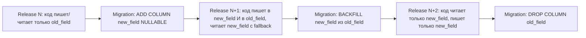

# 18. Миграции

> **Назначение документа.** Зафиксировать правила работы с Doctrine Migrations в проекте `zaborprofil`. Любая правка схемы БД — через миграции; любая миграция — через checklists этого документа.
>
> **Аудитория.** Backend-разработчики, AI-агенты, DevOps, тимлиды.
>
> **Связанные документы.** [17-doctrine-and-database](17-doctrine-and-database.md), [05-domain-model](05-domain-model.md), [34-deployment](34-deployment.md), [36-backup-restore](36-backup-restore.md), [37-runbooks](37-runbooks.md) (инциденты 14–15).

---

## 1. Инструмент и конфигурация

- Bundle: `doctrine/doctrine-migrations-bundle` v4 (см. [composer.json](../composer.json)).
- Конфигурация: `config/packages/doctrine_migrations.yaml`.
- Папка миграций: `migrations/`, namespace `DoctrineMigrations`.
- Хранение состояния: таблица `doctrine_migration_versions` в основной БД.

> **Фактическое состояние.** В проекте присутствуют миграции `Version2026050100010`0…`Version20260502000300.php`. Doctrine Migrations 4 и DBAL 4.

---

## 2. Имена и структура файла

- `Version<YYYYMMDDHHMMSS>.php` — монотонно возрастают.
- Класс `final`, `extends AbstractMigration`.
- Один файл = одна логически целая правка схемы или данных.
- Если в одной задаче нужно два независимых изменения (например, новая таблица + индекс на существующую) — два разных файла.

Минимальный шаблон:

```php
<?php

declare(strict_types=1);

namespace DoctrineMigrations;

use Doctrine\DBAL\Schema\Schema;
use Doctrine\Migrations\AbstractMigration;

final class Version20260601120000 extends AbstractMigration
{
    public function getDescription(): string
    {
        return 'Add description column to settings (nullable, with backfill)';
    }

    public function up(Schema $schema): void
    {
        $this->addSql('ALTER TABLE settings ADD COLUMN description TEXT DEFAULT NULL');
        $this->addSql("UPDATE settings SET description = '' WHERE description IS NULL");
    }

    public function down(Schema $schema): void
    {
        $this->addSql('ALTER TABLE settings DROP COLUMN description');
    }
}
```

> Поле `description` через `getDescription()` обязательно — оно отображается в `doctrine:migrations:list` и помогает дежурному понять, что делает миграция.

---

## 3. Создание миграции

```bash
php bin/console doctrine:migrations:diff
```

Doctrine генерирует diff между текущей схемой и attribute-маппингом. Сгенерированный файл нужно **вручную просмотреть**:

- удалить лишние команды, которые Doctrine сгенерировал «на всякий случай»;
- добавить data migration, если требуется backfill;
- добавить partial index, GIN-индекс, triggers, которых attributes не выражают;
- зафиксировать `getDescription()`;
- добавить `isTransactional(): false`, если используется `CONCURRENTLY` или `VACUUM`.

> **Запрещено.** Коммитить миграцию без чтения её содержимого. Особенно опасно — `DROP COLUMN`, `DROP TABLE`, `ALTER TYPE`, переименования: Doctrine может неверно интерпретировать их как destructive.

---

## 4. Применение

Локально (Docker):

```bash
make migrate
# или
php bin/console doctrine:migrations:migrate --no-interaction
```

В CI:

```bash
php bin/console doctrine:migrations:migrate --env=test --allow-no-migration --no-interaction
```

На VPS:

```bash
# Внутри tools/deploy/deploy-*.sh, после composer install,
# до cache:warmup и до переключения current.
php bin/console doctrine:migrations:migrate --no-interaction
```

> **Запрещено.** Запускать `doctrine:schema:update --force` где угодно (dev, staging, prod). Только миграции.

---

## 5. Стратегия zero-downtime: expand / contract

Production деплоится через release switch (см. [34-deployment](34-deployment.md)). В момент `current → новый release` есть короткий период, когда **старый код может видеть новую схему**, а новый код может видеть **старые данные**. Поэтому миграции должны быть совместимы вперёд и назад.

### 5.1 Универсальный паттерн



Минимум **2–3 релиза** для destructive change. Никогда — drop column в одном релизе с переключением на новое поле.

### 5.2 Добавление nullable поля

Безопасно за один релиз:

```php
$this->addSql('ALTER TABLE pages ADD COLUMN summary TEXT DEFAULT NULL');
```

### 5.3 Добавление NOT NULL поля без default

**Запрещено** делать одной миграцией на непустой таблице — упадёт на существующих строках.

Правильный staged-план:

1. Миграция: `ADD COLUMN summary TEXT DEFAULT NULL`.
2. Релиз: код начинает писать в `summary` для новых записей.
3. Миграция: `UPDATE pages SET summary = '' WHERE summary IS NULL` (или backfill через console command для большой таблицы).
4. Миграция: `ALTER TABLE pages ALTER COLUMN summary SET NOT NULL`.
5. Опционально: `ALTER TABLE pages ALTER COLUMN summary SET DEFAULT ''` (если хочется default).

### 5.4 Удаление поля


Минимум **два релиза**.

### 5.5 Переименование поля

1. `ADD COLUMN new_name`.
2. Backfill: `UPDATE t SET new_name = old_name`.
3. Релиз: код читает/пишет в **оба** поля (dual write).
4. Релиз: код читает только `new_name`, пишет в оба.
5. Релиз: код читает/пишет только `new_name`.
6. Миграция: `DROP COLUMN old_name`.

> **Запрещено.** Использовать `ALTER TABLE … RENAME COLUMN …` напрямую в production-релизе с running кодом. PostgreSQL переименовывает атомарно, но старый код, выполняющий запрос в момент DDL, упадёт с `column "old_name" does not exist`.

### 5.6 Изменение типа поля

Зависит от направления изменения:

- **Расширение** (`int → bigint`, `varchar(50) → varchar(200)`) — обычно безопасно одной миграцией. PostgreSQL обновляет метаданные, но при `varchar → text` не переписывает строки.
- **Сужение** (`bigint → int`, `varchar(200) → varchar(50)`) — потенциально destructive. Требует staged plan: добавить новое поле, backfill с проверкой, switch код, drop старого.
- **Смена семантики** (`text → jsonb`, `varchar → enum`) — почти всегда staged: новое поле + backfill через `USING <expression>` + switch + drop.

Пример безопасного `varchar → text`:

```php
$this->addSql('ALTER TABLE pages ALTER COLUMN summary TYPE TEXT');
```

Пример destructive `text → varchar(255)`:

```php
// Запрещено сразу:
// $this->addSql('ALTER TABLE pages ALTER COLUMN summary TYPE VARCHAR(255)');
//
// Правильно:
// 1) Найти строки с длиной > 255.
// 2) Решить с продуктом, что с ними делать.
// 3) Только потом — ALTER TYPE.
```

### 5.7 Добавление индекса на большую таблицу

В PostgreSQL — `CREATE INDEX CONCURRENTLY`:

```php
public function up(Schema $schema): void
{
    $this->addSql('CREATE INDEX CONCURRENTLY IF NOT EXISTS idx_pages_published_at ON pages (published_at)');
}

public function down(Schema $schema): void
{
    $this->addSql('DROP INDEX IF EXISTS idx_pages_published_at');
}

public function isTransactional(): bool
{
    return false; // CONCURRENTLY не работает внутри транзакции
}
```

Поведение `CONCURRENTLY`:

- не блокирует чтение/запись;
- занимает в 2–3 раза больше времени, чем обычное создание индекса;
- может оставить «invalid» индекс при сбое — нужно проверить `pg_index.indisvalid` и пересоздать.

### 5.8 Удаление индекса

```php
$this->addSql('DROP INDEX CONCURRENTLY IF EXISTS idx_pages_old');
```

`CONCURRENTLY` для DROP INDEX тоже доступно в PostgreSQL 12+ и не блокирует таблицу.

### 5.9 Foreign keys

- При добавлении FK на большую таблицу — сначала `NOT VALID`, потом `VALIDATE CONSTRAINT`:

```php
$this->addSql('ALTER TABLE pages ADD CONSTRAINT fk_pages_author FOREIGN KEY (author_id) REFERENCES users(id) NOT VALID');
$this->addSql('ALTER TABLE pages VALIDATE CONSTRAINT fk_pages_author'); // не блокирует чтение
```

- Всегда явный `ON DELETE` (`SET NULL` / `CASCADE` / `RESTRICT`).

### 5.10 Большой UPDATE/DELETE

Не делать миграцией на миллионах строк — заблокирует таблицу и сломает release. Использовать:

- отдельный console command, обрабатывающий батчами по 1 000–10 000 строк;
- запуск вне окна деплоя;
- логирование прогресса.

```php
// Запрещено внутри миграции:
// $this->addSql('UPDATE pages SET status = ... WHERE ...');  // 5M строк → блокировка

// Правильно:
// Создать app:content:backfill-status console command,
// запустить отдельно после деплоя.
```

---

## 6. Что НЕЛЬЗЯ делать в миграции

- Импортировать и использовать `App\Module\*\Domain\*` (entities, services). Миграция работает только с DBAL/SQL.
- Полагаться на присутствие любых данных (могут быть тестовые миграции с пустой БД).
- Делать долгие data-миграции inline на большой таблице (см. §5.10).
- Менять файл миграции, которая уже была применена в production.
- Удалять файл миграции, которая записана в `doctrine_migration_versions`.
- Использовать `EntityManager`, `Repository`, `Container` внутри `up()`/`down()`.
- Зависеть от текущего времени без зафиксированного значения (для тестируемости).
- Делать `DROP TABLE` с данными без явного «expand/contract → drop» staged plan.

---

## 7. up() / down()

- `up()` обязателен и должен быть idempotent-friendly (`IF NOT EXISTS`, `IF EXISTS`).
- `down()` — best effort. Может быть пустым с комментарием `// not reversible`, если откат обоснованно невозможен (например, `DROP COLUMN` с данными).
- Для production катастрофических случаев откат — это restore из backup, не `down()` (см. [36-backup-restore](36-backup-restore.md), [37-runbooks](37-runbooks.md) §15).
- Если `down()` пустой — всё равно объявить метод, чтобы не падало.

```php
public function down(Schema $schema): void
{
    // Not reversible — see backup restore in docs/36-backup-restore.md
}
```

---

## 8. Тестирование миграций

### 8.1 В CI

- `composer test` поднимает PostgreSQL 18 (см. [35-cicd](35-cicd.md)).
- Шаги:
    1. `doctrine:migrations:status` — показ всех миграций.
    2. `doctrine:migrations:migrate --env=test --allow-no-migration --no-interaction` — применение на свежую БД.
    3. `doctrine:schema:validate --env=test --skip-sync` — синхронизация attributes ↔ схемы.
    4. `phpunit` — функциональные/интеграционные тесты на новой схеме.

### 8.2 Локально перед коммитом

```bash
make db-reset            # пересоздать БД с нуля
php bin/console doctrine:migrations:migrate --no-interaction
php bin/console doctrine:schema:validate --skip-sync
composer test
```

### 8.3 На staging

- Staging deploy запускает миграции автоматически.
- После staging deploy — visual smoke на ключевые admin/публичные страницы.
- Если миграция критическая (большая таблица, ALTER TYPE, drop) — ручная проверка `doctrine:migrations:status` после.

---

## 9. Production deployment миграций

### 9.1 Что делает deploy-скрипт

1. `tools/deploy/deploy-production.sh` снимает `pg_dump` в `shared/backups/db/`.
2. Применяет миграции: `php bin/console doctrine:migrations:migrate --no-interaction`.
3. Если миграция падает — release **не переключается** на `current`. Старый release продолжает обслуживать.
4. Дальше: `cache:clear` → `cache:warmup` → permissions → `current` switch → `systemctl reload php8.5-fpm` → `health-check.sh`.

### 9.2 Что делать, если миграция упала

См. [37-runbooks](37-runbooks.md) §14 («Doctrine migrations failed») и §15 («Миграции применились частично»).

Кратко:

1. **Не паниковать.** Если `current` не переключился — production обслуживает старый release.
2. Прочитать `doctrine:migrations:status` — что применилось, что нет.
3. Прочитать SQL миграции в `migrations/Version<TS>.php` — какой шаг упал.
4. Если миграция применилась частично (см. [37-runbooks](37-runbooks.md) §15) — снять полный backup **немедленно**, дальше следовать runbook.
5. Если миграция явно неверная — поправить в коде, собрать новый release, повторить.
6. Никогда не править файл уже-применённой миграции.

### 9.3 Откат миграции на production

Откат БД через `down()` запрещён в production без явного решения архитектора. Правильный путь:

1. Откатить **release** (переключить `current` на предыдущий) — см. [34-deployment](34-deployment.md), [37-runbooks](37-runbooks.md) §42.
2. Если код предыдущего release несовместим с новой схемой — определить через `expand/contract`, должны быть совместимы. Если несовместимы — это нарушение §5.
3. Если несовместимость абсолютна и данные испорчены — restore из backup до миграции (см. [36-backup-restore](36-backup-restore.md)).

---

## 10. Чек-лист миграции

- [ ] `getDescription()` заполнено осмысленно.
- [ ] Diff проверен глазами; нет лишних DDL.
- [ ] Backward-compatible (или явно объявлено staged через 2+ релиза).
- [ ] Имена индексов/таблиц соответствуют конвенции (`idx_*`, `uniq_*`, `<module>_<resource>`).
- [ ] FK — с явным `ON DELETE`.
- [ ] Если `CREATE INDEX CONCURRENTLY` — `isTransactional() == false`.
- [ ] Не импортирует `App\Module\*\Domain\*`, не использует `EntityManager`.
- [ ] `up()` и (по возможности) `down()` написаны.
- [ ] Идемпотентность: `IF NOT EXISTS` / `IF EXISTS`.
- [ ] Нет destructive change без staged plan.
- [ ] Нет inline-миграции данных на большой таблице (выделено в console command).
- [ ] Прогон в CI прошёл (`status` + `migrate` + `schema:validate`).
- [ ] Backup-этап на production предусмотрен deploy-скриптом.
- [ ] Документация модели в [05-domain-model](05-domain-model.md) обновлена.
- [ ] Entity ↔ schema проверка (`doctrine:schema:validate --skip-sync`) — без ошибок.
- [ ] Repository тесты обновлены (если меняется набор колонок/типов).

---

## 11. Чек-лист production-safe миграции (расширенный)

Для миграций с риском downtime / потери данных дополнительно:

- [ ] Размер таблицы оценён (`SELECT pg_size_pretty(pg_total_relation_size('table'))`).
- [ ] Если таблица > 1 GB или > 1 М строк — план обязательно через `CONCURRENTLY` / batched updates.
- [ ] Прорепетировано на staging с **production-like объёмом данных** (восстановление prod-backup в staging, см. [36-backup-restore](36-backup-restore.md)).
- [ ] Замерено время выполнения на staging.
- [ ] Конфигурация PostgreSQL: `lock_timeout` и `statement_timeout` в `postgresql.conf` или per-session — миграция не должна вешать БД часами.
- [ ] Если миграция длится > 1 минуты — окно обслуживания (maintenance mode, см. [37-runbooks](37-runbooks.md) §62).
- [ ] Retention backup’ов проверен (последний backup доступен и проверен `pg_restore --list`).
- [ ] Stakeholder уведомлён, согласовано окно деплоя.
- [ ] Rollback-план зафиксирован письменно.
- [ ] Дежурный готов мониторить `prod.log`, `pg_stat_activity`, `messenger:stats` в первые 30 минут после деплоя.

---

## 12. Anti-patterns

| Антипаттерн | Почему плохо | Что делать |
|---|---|---|
| `DROP COLUMN` в первом релизе после переключения кода | Старый код в момент release switch падает | Staged: dual-write → switch → drop |
| `ALTER TABLE … ADD COLUMN x NOT NULL` без default на непустой таблице | Падает на существующих строках | NULLABLE → backfill → SET NOT NULL |
| `CREATE INDEX` без CONCURRENTLY на большой таблице | Блокирует чтение/запись | `CREATE INDEX CONCURRENTLY` + `isTransactional() == false` |
| `UPDATE big_table SET …` в миграции | Длинная транзакция, блокировка | Console command, batched, вне миграции |
| `RENAME COLUMN` в одном релизе | Старый код падает | ADD new + dual-write + switch + DROP old |
| Изменение применённой миграции | Расхождение `doctrine_migration_versions` со схемой | Создать новую миграцию, не править старую |
| `EntityManager` внутри миграции | Зависимость от текущей версии Domain — миграция сломается через 6 месяцев | Только DBAL SQL |
| `DROP TABLE` без backfill в новую структуру | Безвозвратная потеря данных | Backfill → switch → drop в отдельных релизах |
| `down()` пустой без комментария | Непонятно, обратимо или нет | `// not reversible — see docs/36-backup-restore.md` |
| `doctrine:schema:update --force` | Обходит миграции; следующая миграция упадёт на расхождении | Запрещено везде |

---

## 13. Rollback considerations

- Нельзя «откатить» миграцию, которая удалила данные. Откат = restore из backup + repoint.
- Перед production-миграцией всегда есть свежий backup (`tools/deploy/deploy-production.sh` делает `pg_dump` в `shared/backups/db/`).
- Retention backup’ов — минимум 14 дней (см. [36-backup-restore](36-backup-restore.md)).
- Restore — в **отдельную** БД (`<db>_restored`), не поверх production. Затем — переключение через смену `DATABASE_URL`.

---

## 14. Чек-лист для AI-агента при изменении БД

Перед изменением:

- [ ] Прочитан этот документ + [17-doctrine-and-database](17-doctrine-and-database.md) + [05-domain-model](05-domain-model.md).
- [ ] Классифицировано как «Database schema change» или «Doctrine entity change» (см. [41-implementation-playbook](41-implementation-playbook.md) §13).
- [ ] Составлен planning note (см. [41-implementation-playbook](41-implementation-playbook.md) §5).
- [ ] Определена стратегия: одношаговая или staged через 2+ релиза.
- [ ] Оценён размер таблицы (хотя бы примерно, по [05-domain-model](05-domain-model.md)).

Во время изменения:

- [ ] Миграция создана через `doctrine:migrations:diff` и просмотрена глазами.
- [ ] Миграция работает только с DBAL/SQL, не импортирует Domain.
- [ ] Заполнен `getDescription()`.
- [ ] Если CONCURRENTLY — `isTransactional() == false`.
- [ ] Entity-attributes согласованы с миграцией.
- [ ] Repository обновлён, если поменялся контракт.
- [ ] Тесты обновлены.

После изменения:

- [ ] `doctrine:migrations:status` — показывает новую миграцию.
- [ ] `doctrine:migrations:migrate --env=test` — успешно.
- [ ] `doctrine:schema:validate --skip-sync` — без ошибок.
- [ ] `composer test` — зелёный.
- [ ] Документация в [05-domain-model](05-domain-model.md) обновлена.
- [ ] План rollback зафиксирован в planning note.

Запрещено:

- Менять файл уже-применённой миграции.
- Делать destructive change в одном релизе с переключением кода.
- Использовать `doctrine:schema:update --force`.
- Делать `UPDATE`/`DELETE` миллионов строк в `up()`.
- Импортировать Domain в миграцию.

---

## 15. Связанные документы

- [05-domain-model](05-domain-model.md) — что меняется в модели вместе со схемой.
- [17-doctrine-and-database](17-doctrine-and-database.md) — правила маппинга, индексов, типов.
- [34-deployment](34-deployment.md) — место миграций в release-процессе.
- [35-cicd](35-cicd.md) — как миграции проверяются в CI.
- [36-backup-restore](36-backup-restore.md) — стратегия backup и restore при инциденте.
- [37-runbooks](37-runbooks.md) — инциденты 14 (failed) и 15 (партикл).
- [41-implementation-playbook](41-implementation-playbook.md) §13 — DB schema change playbook.
