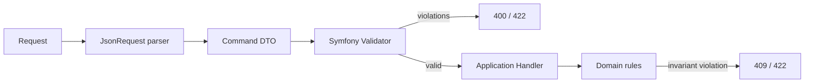

# 19. Forms, DTO, Validation

См. также [ADR-0005](adr/0005-dto-validator-over-heavy-formtype.md).

## Стратегия

| Случай | Что использовать |
|---|---|
| Admin JSON API | DTO + Symfony Validator |
| Public API | DTO + Symfony Validator |
| Console command input | option/argument + ручная валидация |
| Login form (HTML) | Symfony FormType с CSRF |
| Сложная HTML-форма с десятками полей и nested collections | Symfony FormType (только если оправдано) |

DTO + Validator — **default**. FormType — исключение, оправдывается удобством для редактора и шаблонов.

## DTO как input

```php
final class CreatePageCommand
{
    public function __construct(
        #[Assert\NotBlank]
        #[Assert\Choice(callback: [PageType::class, 'cases'])]
        public readonly PageType $type,

        #[Assert\NotBlank]
        #[Assert\Length(min: 1, max: 255)]
        public readonly string $title,

        #[Assert\NotBlank]
        #[Assert\Regex('/^[a-z0-9]+(?:-[a-z0-9]+)*$/')]
        public readonly string $slug,

        #[Assert\NotBlank]
        #[Assert\Regex('/^\/[a-z0-9_\-\.\/]*$/')]
        public readonly string $path,

        #[Assert\NotBlank]
        #[Assert\Length(min: 1, max: 255)]
        public readonly string $h1,

        public readonly string $template = 'default',
        public readonly int $sortOrder = 0,
        public readonly bool $indexable = true,
    ) {
    }
}
```

Правила:

- `final readonly class`.
- Поля типизированы.
- Validation constraints на полях.
- Никаких setter’ов; конструктор — единственная точка входа.
- DTO не зависит от Symfony HTTP.

## Парсинг JSON в DTO

`App\Module\Content\UI\Admin\JsonRequest::parse(...)` (фактическое — точечный helper) — целевое расширить до общего `App\Shared\UI\Http\JsonRequestParser` для всех admin/public API. Можно использовать `Symfony\Component\Serializer\SerializerInterface` (`fromJson`) + `ValidatorInterface`.

## Where validation happens



- **Format** — DTO + Validator.
- **Бизнес-инварианты** — Domain Entity.
- **Бизнес-проверки уровня сценария** (uniqueness, идемпотентность) — Application Handler с использованием Repository interfaces.

## Когда FormType всё же оправдан

- Сложная вложенная HTML-форма с file upload и CSRF.
- Нужен Symfony Form theme и rendering helpers.
- Форма используется в Twig напрямую (без отдельной JS-логики).

В нашем проекте таким единственным случаем сейчас является login form. Любая admin-операция уже идёт через Vue + JSON API.

## Что нельзя

- **Валидировать только на frontend.** Любые ограничения дублируются на backend.
- **Передавать `Request` в Domain.** Только распарсенный DTO.
- **Использовать Entity как форму.** Form/DTO ↔ Entity — это два разных мира; маппинг — в Application/handler.
- **Смешивать validation и business rules.** Validator не должен знать про uniqueness — это handler.
- **Огромные общие DTO** на несколько сценариев. Лучше отдельный DTO под каждый use case.

## Anti-patterns

| Симптом | Решение |
|---|---|
| `Symfony\Component\Form` в `Application` | Перенести в UI/Controller |
| Constraints на Doctrine Entity | Перенести на DTO |
| `request->get('foo')` в handler | Принимать DTO |
| `array $data` как input handler | Превратить в типизированный DTO |
| 30 правил на одном DTO | Разделить на DTO под use case |

## Чек-лист DTO + Validator

- [ ] DTO `final readonly class`.
- [ ] Поля строго типизированы.
- [ ] Constraints покрывают формат и required.
- [ ] DTO не импортирует Symfony HTTP, Doctrine, Twig.
- [ ] Парсинг JSON в DTO — централизованный helper.
- [ ] В контроллере: parse → validate → handler.
- [ ] Unit-тест на DTO + violation list.

## Связанные документы

- [09-application-layer](09-application-layer.md)
- [08-controller-architecture](08-controller-architecture.md)
- [30-error-handling](30-error-handling.md)
- [adr/0005-dto-validator-over-heavy-formtype](adr/0005-dto-validator-over-heavy-formtype.md)
