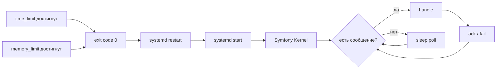

# 24. Messenger и очереди

## Текущая конфигурация

`config/packages/messenger.yaml`:

- Failure transport — `failed` (Doctrine).
- Транспорт `async` — Doctrine (через `MESSENGER_TRANSPORT_DSN=doctrine://default?auto_setup=0`).
- Транспорт `failed` — `doctrine://default?queue_name=failed`.
- Routing: `App\Shared\Infrastructure\Logging\Message\SendTelegramLogMessage` → `async`.

В `test` оба транспорта — `in-memory://`.

> **Важно.** В проекте Messenger использует **Doctrine transport**, а не Redis transport. Это сознательно: одна точка отказа меньше, транзакционность с БД, простой backup. См. [ADR-0007](adr/0007-redis-cache-and-messenger.md).

## Зачем нужен Messenger

- Отправка email’ов и Telegram-логов вне HTTP-цикла.
- Будущее: media processing, sitemap generation, search indexing, bulk imports/exports, lead notifications.

## Структура

```text
src/Module/<Name>/
├── Application/
│   ├── Message/                  # immutable DTO сообщений
│   └── MessageHandler/           # handler’ы #[AsMessageHandler]
src/Shared/Infrastructure/Logging/
├── Message/SendTelegramLogMessage.php
└── MessageHandler/SendTelegramLogMessageHandler.php
```

## Сообщение

```php
final class SendTelegramLogMessage
{
    public function __construct(
        public readonly string $level,
        public readonly string $message,
        public readonly array $context = [],
    ) {
    }
}
```

Правила:

- `final readonly class`.
- Только примитивы / value objects.
- **Никаких Doctrine entity** в сообщении (entity при попадании в очередь устаревает, теряет identity).

## Handler

```php
#[AsMessageHandler]
final class SendTelegramLogMessageHandler
{
    public function __invoke(SendTelegramLogMessage $message): void
    {
        // ...
    }
}
```

Правила:

- Один класс — один сценарий.
- Не возвращать значения (или возвращать только если используется в `MessageHandlerInterface` request/reply).
- Идемпотентность желательна: если сообщение пришло дважды, второй раз не должен вызывать побочный эффект.

## Worker

Production:

```bash
systemctl start zaborprofil-messenger.service
```

Файл — `tools/deploy/templates/zaborprofil-messenger.service`:

- Запускает `php bin/console messenger:consume async failed --time-limit=3600 --memory-limit=128M`.
- `Restart=always`.
- Лимиты времени/памяти для управления утечками.

Local Docker:

```bash
make shell
php bin/console messenger:consume async -vv
```

## Retries

По умолчанию Messenger делает 3 попытки с экспоненциальным backoff (`1s, 5s, 25s`). Конфигурируется в `framework.messenger.transports.async.retry_strategy`. На permanent-failure сообщение уходит в `failed` транспорт.

## Failed transport

```bash
php bin/console messenger:failed:show
php bin/console messenger:failed:retry
php bin/console messenger:failed:remove <id>
```

Целевое: alert при росте `failed > N` (см. [37-runbooks](37-runbooks.md)).

## Idempotency

Для критичных операций — handler проверяет, не обработано ли сообщение раньше:

- Через дополнительную таблицу `processed_messages` (id сообщения + timestamp).
- Через идемпотентный side effect (например, "publish" страницы — вызов идемпотентен по природе).

## Delayed messages

`Symfony\Component\Messenger\Stamp\DelayStamp` — отложить сообщение на N секунд. Doctrine transport поддерживает delayed messages (хранится `available_at`).

## Scheduled tasks (целевое)

Symfony Scheduler позволяет периодические задачи без cron:

```php
#[AsSchedule]
final class SitemapSchedule implements ScheduleProviderInterface { /* ... */ }
```

## Что НЕ передавать через Messenger

- Doctrine Entity (передавать ID).
- Файлы blob (передавать путь / S3 key).
- Большие массивы JSON (хранить в БД, передавать ID).
- Секреты в plain text.

## Worker lifecycle



## Graceful shutdown

`messenger:consume` сам ловит `SIGTERM`, заканчивает текущее сообщение и завершает процесс. systemd шлёт `SIGTERM` при `systemctl stop`. Не использовать `kill -9` — это потеряет текущее сообщение.

## Logging

- Канал `messenger` (целевое — добавить в `monolog.yaml`).
- Каждое сообщение логирует `request_id` (наследуется от продьюсера через stamp), id сообщения, длительность.

## Anti-patterns

- Передача Entity через message.
- `try { ... } catch (\Throwable) { /* swallow */ }` в handler — теряем retry.
- Idempotency через очередь без сохранения состояния — после fail каждый retry повторяет side effect.
- Использовать Messenger для синхронной обработки — потеря смысла.

## Чек-лист добавления async-сообщения

- [ ] Класс сообщения — `final readonly`, только примитивы.
- [ ] Handler — `#[AsMessageHandler]`, идемпотентен.
- [ ] Routing прописан в `messenger.yaml`.
- [ ] Retry-стратегия адекватна (быстрые операции — больше попыток, тяжёлые — меньше).
- [ ] Лог входа/выхода handler.
- [ ] Unit-тест на handler с моком зависимостей.
- [ ] Functional-тест с `in-memory://` транспортом.
- [ ] Documentation модуля обновлена.

## Связанные документы

- [11-infrastructure-layer](11-infrastructure-layer.md)
- [28-logging-observability](28-logging-observability.md)
- [29-healthchecks](29-healthchecks.md)
- [37-runbooks](37-runbooks.md)
