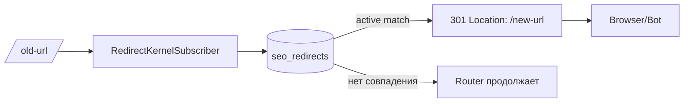

# 26. SEO архитектура

> **Назначение документа.** Зафиксировать SEO-контракт CMS Engine `zaborprofil.ru`: URL, метаданные, sitemap, robots, redirects, structured data, performance. Любая фича проходит проверку через этот документ.
>
> **Аудитория.** Backend-разработчики, frontend, контент-редакторы, SEO-специалист, AI-агенты, DevOps.
>
> **Связанные документы.** [13-front-area](13-front-area.md), [16-routing](16-routing.md), [21-templates-and-twig](21-templates-and-twig.md), [ADR-0010](adr/0010-seo-first-cms-architecture.md).

> SEO — **первоклассная часть домена**, а не «слой над контентом». Любая фича CMS должна осознанно отвечать на вопрос «как это влияет на SEO».

---

## 1. SEO-инварианты проекта

Эти инварианты не подлежат нарушению без обновления [ADR-0010](adr/0010-seo-first-cms-architecture.md).

1. **Публичный сайт всегда SSR.** Робот Google/Yandex получает готовый HTML без необходимости исполнять JS. Никакой SPA для публичной зоны.
2. **URL — контракт с поисковиком.** Любая смена `Page.path` сопровождается `Redirect 301` со старого пути на новый.
3. **Только опубликованный + индексируемый контент попадает в `sitemap.xml`.** Drafts/archived/soft-deleted — никогда.
4. **Один URL — одна каноническая страница.** Дубли по querystring, trailing slash, host вариантам — резолвятся через canonical и/или 301.
5. **Robots зависит от окружения.** На staging/preview всегда `Disallow: /`. На production — управляемый.
6. **Admin/API/Dev-зоны не индексируются никогда.** На уровне роутинга, response-header (`X-Robots-Tag: noindex,nofollow`), `<meta>` и nginx (для dev).
7. **Каждое индексируемое изображение имеет `alt`.** Валидация — на DTO upload и на admin-форме.
8. **Изменение SEO-полей опубликованной страницы трактуется как production-risk операция** и сопровождается smoke-тестом в `app:seo:audit` (целевое).

> **Запрещено.** Менять `Page.path` опубликованной страницы без `Redirect`. Удалять `Redirect`, который ведёт на живой URL. Включать `noindex` для главной без явного решения. Помещать утечки внутреннего контента в `<title>`/`<description>` (имена сотрудников, ID заказов и т. п.).

## 1.1 Фактический SEO baseline

- `/sitemap.xml` автоматически становится sitemap index, когда индексируемых страниц больше `app.sitemap_chunk_size`.
- `RobotsController` в non-prod всегда отдаёт `Disallow: /`, в prod robots управляется через admin API.
- `app:seo:audit` и `GET /admin/api/seo/audit/pages/{id}` работают как операционный SEO-контроль.
- Публичные страницы кэшируются через `cache.public_page`; изменения контента и SEO-сущностей сбрасывают SEO-зависимый кэш.
- Публичные lead-формы используют neutral `202` для spam и не создают SEO-шум.

---

## 2. URL strategy

### 2.1 Структура URL

- URL для `Page` = значение поля `Page.path`, задаётся **вручную** редактором.
- Сохраняем существующие WordPress-URL без изменения для бесшовной миграции.
- Структура: `/segment-1/segment-2/...`. Только нижний регистр. Разделитель — `-` (минус).
- Trailing slash **не нормализуется автоматически**: если редактор задал `/about/`, оставляем; если `/about` — оставляем. Дублей быть не должно (canonical + redirect).
- ASCII-only в path. Кириллица транслитерируется при создании страницы.
- Максимальная длина path — 512 символов (см. [17-doctrine-and-database](17-doctrine-and-database.md)).

### 2.2 Slug

- `slug` — компонент пути, не сам путь.
- Регулярное выражение: `^[a-z0-9]+(?:-[a-z0-9]+)*$`.
- Проверяется в `Page::normalizeSlug()` ([Page.php](../src/Module/Content/Domain/Entity/Page.php)).
- Длина 3–180 символов.
- Запрещены: `__`, `--`, ведущие/конечные `-`, цифровые-only slug (`12345`), зарезервированные сегменты (`admin`, `api`, `_profiler`, `health`, `build`, `uploads`, `sitemap.xml`, `robots.txt`).

### 2.3 Path

- Регулярное выражение: `^\/[a-z0-9_\-./]*$`.
- Никаких `//` (двойных слешей).
- Проверяется в `Page::normalizePath()`.
- Уникальность среди `deleted_at IS NULL` через **partial unique index** (см. [17-doctrine-and-database](17-doctrine-and-database.md)).

### 2.4 Запрещённые префиксы пути

Нельзя создать `Page` с `path`, начинающимся на:

- `/admin` (admin-зона);
- `/api` (api-зона);
- `/dev`, `/_profiler`, `/_wdt`, `/_fragment` (dev-зона);
- `/build` (assets);
- `/uploads` (статика);
- `/health` (healthcheck).

Эти префиксы зарезервированы маршрутизацией (см. [16-routing](16-routing.md)).

---

## 3. Canonical URL

### 3.1 Правила

- На каждой публичной странице есть `<link rel="canonical">`. Источник:
  - `Page.canonicalUrl` если задан редактором (валидируется как абсолютный URL),
  - иначе — автогенерация через `absolute_url(page.path)` в `PublicPageController`.
- Canonical всегда абсолютный с `https://` (production); валидация в `Page::normalizeOptionalAbsoluteUrl`.
- Если есть utm/page-параметры — canonical всё равно указывает на основной URL **без параметров** (если редактор не задал явное значение).
- При наличии нескольких URL с одним контентом — canonical указывает на каноничный, остальные получают 301 через `Redirect`.

### 3.2 Когда указывать canonical явно

- Любая публичная страница, которая может быть найдена по нескольким URL (пагинация, фильтры, sort).
- Категории/подкатегории каталога (целевое).
- Страницы с трекинговыми параметрами в реферрерах.

### 3.3 Anti-patterns

- Canonical с querystring (`?utm_*`, `?page=2`).
- Canonical с протоколом `http://` на production HTTPS.
- Canonical, указывающий на 404/301 страницу.
- Canonical-самопересечение: `/a` → canonical `/b`, `/b` → canonical `/a`.

---

## 4. Title / Description / H1

### 4.1 Хранение

**Фактическое состояние** ([`Page` entity](../src/Module/Content/Domain/Entity/Page.php), миграция `Version20260503000100`):

| Поле | Тип | Где рендерится |
|---|---|---|
| `title` | `string(255)`, NOT NULL | `<title>` в `base.html.twig` блок `title` |
| `h1` | `string(255)`, NOT NULL | `<h1>` в `show.html.twig` |
| `indexable` | `bool`, NOT NULL | `<meta name="robots">` в `base.html.twig` через `meta_robots` |
| `meta_description` | `string(320)`, NULL | `<meta name="description">` |
| `canonical_url` | `string(2048)`, NULL | `<link rel="canonical">` (если NULL — fallback на `absolute_url(page.path)`) |
| `og_title` | `string(255)`, NULL | `<meta property="og:title">` (fallback на `title`) |
| `og_description` | `string(320)`, NULL | `<meta property="og:description">` (fallback на `meta_description`) |
| `og_image` | `string(2048)`, NULL | `<meta property="og:image">` + автоматически twitter card |
| `og_type` | `string(32)`, NULL | `<meta property="og:type">` (default `website`) |
| `json_ld` | `JSONB`, NULL | массив `<script type="application/ld+json">` блоков |

Управление через admin API: `PUT /admin/api/content/pages/{id}/seo` (требует `AdminPermission::SEO_EDIT`). Все SEO-поля nullable; пустая строка нормализуется в NULL; canonical/og_image валидируются как абсолютные URL.

**Целевое состояние** — выделение в embedded `SeoMetadata` (см. [05-domain-model](05-domain-model.md), [ADR-0010](adr/0010-seo-first-cms-architecture.md)) при появлении дополнительных контейнеров (Product, Category, Landing-вариации).

### 4.2 Twig-шаблон (фактический)

`base.html.twig` декларирует блоки `meta_description`, `meta_robots`, `canonical_url`, `meta_open_graph`, `json_ld`. Они работают через переменные, которые передаёт `PublicPageController` из `PublicPageView` ([`PublicPageController`](../src/Module/Content/UI/Web/PublicPageController.php), [`PublicPageView`](../src/Module/Content/Application/Service/PublicPageView.php)):

| Переменная Twig | Источник |
|---|---|
| `meta_description` | `page.metaDescription` |
| `meta_robots` | `'index, follow'` или `'noindex, nofollow'` (на основе `page.isIndexable`) |
| `canonical_url` | `page.canonicalUrl` или `absolute_url` от `page.path` |
| `og_type`, `og_title`, `og_description`, `og_image` | соответствующие поля `Page`, с fallback'ами |
| `json_ld_blocks` | базовый `SchemaOrgBuilder::webPage()` + редакторские `page.jsonLd` блоки |

`templates/public/page/show.html.twig` рендерит только `<title>` (через extends `base`) и `<h1>` (явно). Все meta-теги — в `base.html.twig`.

### 4.3 Конвенции

- `title`: 30–65 символов, со своим брендом в конце через ` — `.
- `description`: 140–160 символов, без обрезаний посередине предложения.
- `h1`: один на страницу, может отличаться от title (h1 — для пользователя, title — для SERP).

### 4.4 Anti-patterns

- Несколько `<h1>` на одной странице.
- Дублирующиеся title для разных страниц.
- Description обрезается на середине предложения.
- Title/description с placeholder’ами (`{{ category.name }}`) без fallback’а.

---

## 5. Robots

### 5.1 Page-level

- Поле `Page.indexable` (`bool`) хранится в БД, доступно в admin-API и **рендерится** в `<meta name="robots">`: `index, follow` для `true`, `noindex, nofollow` для `false`. Логика — в `PublicPageController` (переменная `meta_robots`).
- По умолчанию для новой страницы — `indexable=true`.
- Для admin/preview/dev URL — всегда `noindex,nofollow` (программно): admin покрыт `AdminNoIndexSubscriber`, dev/staging — через `RobotsController` (см. §5.2).

### 5.2 robots.txt

- Файл `robots.txt` рендерится `Module\Seo\UI\Web\RobotsController` ([код](../src/Module/Seo/UI/Web/RobotsController.php)).
- В `dev`/`staging` окружениях — `User-agent: *` + `Disallow: /` (полный запрет индексации).
- В `prod` — стандартный robots с `Sitemap:` директивой и точечными `Disallow:` для служебных путей.
- Редактирование production robots.txt: `GET/PUT /admin/api/seo/robots` (требует `AdminPermission::SEO_EDIT`), значение хранится в Settings `seo.robots_txt`.

Минимальный production robots.txt:

```text
User-agent: *
Disallow: /admin
Disallow: /api
Disallow: /_profiler
Disallow: /_wdt
Disallow: /_fragment
Disallow: /dev

Sitemap: https://zaborprofil.ru/sitemap.xml
```

### 5.3 Header-уровень

- Admin-зона: `AdminNoIndexSubscriber` ставит `X-Robots-Tag: noindex, nofollow` на все ответы под `/admin/*` ([код](../src/Module/Admin/Infrastructure/Http/AdminNoIndexSubscriber.php)).
- API-зона: `Content-Type: application/json` + отсутствие meta-тегов; на любую возможность экспонирования — `X-Robots-Tag: noindex`.

### 5.4 Anti-patterns

- `Disallow: /` на production по ошибке (deploy staging-конфига).
- Закрывать в robots.txt URL и одновременно ставить canonical/301 на тот же URL — поисковик не сможет распарсить заблокированную страницу.
- Использовать robots.txt для сокрытия секретов (это публичный файл).

---

## 6. Sitemap

### 6.1 Текущая реализация

- `sitemap.xml` рендерится `Module\Seo\UI\Web\SitemapController` ([код](../src/Module/Seo/UI/Web/SitemapController.php)).
- Включаются **только** `PageStatus::Published` + `indexable=true`, без `deletedAt`.
- `<lastmod>` — `updatedAt` страницы в формате `YYYY-MM-DD`.
- `<priority>` и `<changefreq>` — по умолчанию опускаются (Google их игнорирует).
- Если число URL превышает `app.sitemap_chunk_size`, `/sitemap.xml` отдаёт sitemap index, а страницы попадают в `/sitemap-pages-N.xml`.

### 6.2 Целевая архитектура (для роста каталога)

При росте каталога — расширение индексного sitemap дополнительными источниками:

```text
/sitemap.xml          (sitemap index)
  ├── /sitemap-pages-1.xml      (≤ 50 000 URL, ≤ 50 МБ uncompressed)
  ├── /sitemap-pages-2.xml
  ├── /sitemap-products-1.xml
  └── /sitemap-news-1.xml       (с <news:news> блоками для Google News, целевое)
```

Лимиты Google:

- ≤ 50 000 URL на один sitemap-файл;
- ≤ 50 МБ uncompressed;
- gzip-сжатие допустимо.

### 6.3 Чек-лист sitemap-изменения

- [ ] Не попадают drafts/archived/deleted страницы.
- [ ] Не попадают noindex-страницы.
- [ ] Все URL — абсолютные с production-доменом и https.
- [ ] `lastmod` отражает реальную дату обновления контента.
- [ ] Sitemap отдаётся с `Content-Type: application/xml`.
- [ ] Sitemap не превышает 50 000 URL / 50 МБ.
- [ ] При расширении сущностей (продукты, новости) — добавлен соответствующий тип в sitemap-индекс.

---

## 7. Redirects

### 7.1 Контракт

- Сущность `Module\Seo\Domain\Entity\Redirect` ([код](../src/Module/Seo/Domain/Entity/Redirect.php)).
- Обрабатывается `RedirectKernelSubscriber` на `kernel.request` **до** Router (priority выше, см. [код](../src/Module/Seo/Infrastructure/Http/RedirectKernelSubscriber.php)).
- Поддерживает 301 и 302; default — 301.
- Поле `active` — для временного отключения без удаления.

### 7.2 Автоматическое создание при смене path

- При смене `Page.path` — `PagePathChangeListener` ([код](../src/Module/Seo/Infrastructure/Doctrine/PagePathChangeListener.php)) создаёт 301 со старого пути на новый.
- Если для нового пути уже есть `Redirect → старый путь` — это loop, и операция должна быть отклонена в Application.

### 7.3 Когда 301 vs 302

- **301 (Moved Permanently).** URL переехал навсегда, поисковик переносит ссылочный вес. Использовать по умолчанию.
- **302 (Found).** Временный редирект (A/B-тест, временная заглушка, локализация по гео). Поисковик не переносит ссылочный вес.

### 7.4 Поток обработки



### 7.5 Запрещено

- Удалять `Redirect`, который указан внешними ссылками или внутри ранжирующейся страницы Google.
- Создавать цепочки `A → B → C` длиннее 1 шага. Поисковик ходит максимум 2–3 редиректа; создавать сразу `A → C` и `B → C`.
- Использовать `meta refresh` или JS `window.location` вместо HTTP-редиректа. Поисковик такие переходы либо игнорирует, либо учитывает как 302.
- Конфликт правил между nginx-уровнем и `RedirectKernelSubscriber`. Принцип: **либо nginx, либо Symfony** для конкретного URL.

### 7.6 Чек-лист redirect-изменения

- [ ] Старый URL действительно был публичным и индексируемым.
- [ ] Новый URL отдаёт 200 (не 404, не 301 в третий URL).
- [ ] Тип — 301, если переезд постоянный.
- [ ] Нет петель (`A → B → A`).
- [ ] Нет цепочек длиннее 1 шага.
- [ ] Старый URL не упомянут в sitemap.
- [ ] В тестах есть functional-тест на этот redirect.

---

## 8. OpenGraph / Twitter Cards

### 8.1 Минимальный набор тегов

`base.html.twig` блок `meta_open_graph` рендерит:

- `og:site_name = ЗаборПрофиль` (статика).
- `og:type` — `Page.ogType` или `'website'` (default).
- `og:title` — `Page.ogTitle` или `block('title')`.
- `og:description` — `Page.ogDescription` или `Page.metaDescription`.
- `og:url` — равен `canonical_url`.
- `og:image` — `Page.ogImage`. Если задан, дополнительно рендерится `twitter:card = summary_large_image` и `twitter:image`.

```twig
<meta property="og:type"        content="{{ og_type|default('website') }}">
<meta property="og:url"         content="{{ canonical_url|default(absolute_url(page.path)) }}">
<meta property="og:title"       content="{{ og_title|default(page.title) }}">

    <meta property="og:description" content="{{ og_description }}">


    <meta property="og:image" content="{{ absolute_url(og_image) }}">

<meta property="og:locale"      content="ru_RU">
<meta property="og:site_name"   content="ЗаборПрофиль">

<meta name="twitter:card"        content="summary_large_image">
<meta name="twitter:title"       content="{{ og_title|default(page.title) }}">

    <meta name="twitter:description" content="{{ og_description }}">


    <meta name="twitter:image" content="{{ absolute_url(og_image) }}">

```

### 8.2 Изображение OG

- Минимум 1200×630 px (рекомендовано 1200×630 для Twitter `summary_large_image`).
- Под 8 МБ.
- JPEG/PNG/WebP.
- Если редактор не загрузил — fallback на `/og/default.jpg`.

### 8.3 Anti-patterns

- `og:url` отличается от canonical.
- `og:image` относительный путь — не работает в большинстве парсеров.
- Разные `og:title` и `<title>` без причины — соцсети показывают первое, поисковик — второе.

---

## 9. Schema.org / JSON-LD

### 9.1 Принципы

- Structured data рендерится в `<script type="application/ld+json">` в `<head>`.
- Используется только schema.org словарь.
- На один тип сущности — один JSON-LD блок.
- Тестировать через [Google Rich Results Test](https://search.google.com/test/rich-results).

### 9.2 `Organization` на главной (целевое)

```html
<script type="application/ld+json">
{
  "@context": "https://schema.org",
  "@type": "Organization",
  "name": "Zaborprofil",
  "url": "https://zaborprofil.ru",
  "logo": "https://zaborprofil.ru/og/logo.png",
  "telephone": "+7-XXX-XXX-XX-XX",
  "address": {
    "@type": "PostalAddress",
    "streetAddress": "...",
    "addressLocality": "Москва",
    "postalCode": "...",
    "addressCountry": "RU"
  },
  "sameAs": [
    "https://t.me/zaborprofil",
    "https://vk.com/zaborprofil"
  ]
}
</script>
```

### 9.3 `BreadcrumbList` на внутренних страницах

```html
<script type="application/ld+json">
{
  "@context": "https://schema.org",
  "@type": "BreadcrumbList",
  "itemListElement": [
    {"@type": "ListItem", "position": 1, "name": "Главная",     "item": "https://zaborprofil.ru/"},
    {"@type": "ListItem", "position": 2, "name": "Каталог",    "item": "https://zaborprofil.ru/catalog/"},
    {"@type": "ListItem", "position": 3, "name": "Профнастил", "item": "https://zaborprofil.ru/catalog/profnastil/"}
  ]
}
</script>
```

### 9.4 `Product` для каталога (целевое)

```html
<script type="application/ld+json">
{
  "@context": "https://schema.org",
  "@type": "Product",
  "name": "Профнастил С8",
  "image": ["https://zaborprofil.ru/uploads/.../1.jpg"],
  "description": "...",
  "sku": "PROFNASTIL-C8",
  "brand": {"@type": "Brand", "name": "Zaborprofil"},
  "offers": {
    "@type": "Offer",
    "url": "https://zaborprofil.ru/catalog/profnastil-c8/",
    "priceCurrency": "RUB",
    "price": "450",
    "availability": "https://schema.org/InStock"
  }
}
</script>
```

### 9.5 `FAQPage` для FAQ-блоков (целевое)

```html
<script type="application/ld+json">
{
  "@context": "https://schema.org",
  "@type": "FAQPage",
  "mainEntity": [
    {
      "@type": "Question",
      "name": "Какой срок доставки?",
      "acceptedAnswer": {"@type": "Answer", "text": "..."}
    }
  ]
}
</script>
```

### 9.6 Anti-patterns

- JSON-LD упоминает данные, которых нет на странице — Google трактует как cloaking.
- Несколько `BreadcrumbList` на странице.
- Schema без обязательных полей (например, `Product` без `offers.price`).
- Невалидный JSON (запятые, кавычки) — блок игнорируется молча.

---

## 10. Pagination

### 10.1 Правила

- При листингах с `?page=N` — каноникал указывает на **первую** страницу (`?page=1` без параметров).
- Для дублирующихся страниц добавляется `<meta name="robots" content="noindex,follow">`.
- `rel="prev"` / `rel="next"` — Google официально перестал учитывать, но Yandex и Bing — учитывают.

```twig

    <link rel="prev" href="{{ url('list', {page: page - 1}) }}">


    <link rel="next" href="{{ url('list', {page: page + 1}) }}">



    <meta name="robots" content="noindex,follow">

```

### 10.2 Anti-patterns

- Каноникал каждой страницы пагинации указывает на саму себя — поисковик индексирует дубли.
- `noindex` на первой странице каталога — теряется индексация всего раздела.
- Пагинация через `#hash` (JS-only) — поисковик не видит контент глубже первой страницы.

---

## 11. Breadcrumbs

- `BreadcrumbBuilder` строит цепочку от `Page.path`: `Главная → Раздел → Текущая`.
- Twig helper `breadcrumbs_for_page(page)` доступен для публичных шаблонов.
- HTML breadcrumbs рендерятся на публичных страницах с глубиной больше корня.
- JSON-LD `BreadcrumbList` добавляется автоматически.
- Последний элемент breadcrumbs — без ссылки (текущая страница).
- Parent-структура `Page.parent` остаётся extension point для более точных названий промежуточных разделов.

---

## 12. Image alt / title

### 12.1 Правила

- Editor обязан заполнять `alt` для каждого изображения в блоке.
- Валидация — на уровне DTO upload’а (см. [25-files-and-uploads](25-files-and-uploads.md)) и admin-форм.
- `app:seo:audit` (целевое) проверяет отсутствие alt’ов.
- `` — опционально, дублирует alt.

### 12.2 Что писать в alt

- Описать, что изображено, в 5–15 слов.
- Не начинать с «Изображение …» / «Фото …».
- Для декоративных изображений — `alt=""` (пустой), не пропускать атрибут.

### 12.3 Lazy loading

```html

```

- `loading="lazy"` — для всех картинок ниже fold.
- `width`/`height` — обязательны, чтобы избежать CLS.
- `decoding="async"` — не блокирует рендер.

---

## 13. Performance / Core Web Vitals

### 13.1 Целевые метрики

| Метрика | Что значит | Цель | Алёрт |
|---|---|---|---|
| **LCP** | Largest Contentful Paint | ≤ 2.5 c | > 4.0 c |
| **INP** | Interaction to Next Paint | ≤ 200 мс | > 500 мс |
| **CLS** | Cumulative Layout Shift | ≤ 0.1 | > 0.25 |
| **TTFB** | Time To First Byte | ≤ 200 мс на warm cache | > 600 мс |
| **FCP** | First Contentful Paint | ≤ 1.8 c | > 3.0 c |

Источник правды — [Web Vitals](https://web.dev/articles/vitals), [PageSpeed Insights](https://pagespeed.web.dev/), [Google Search Console](https://search.google.com/search-console) → «Эффективность страниц».

### 13.2 Что делает CMS для CWV

- **TTFB ≤ 200 мс на warm cache.** Symfony cache (`cache.system`, `cache.app`), Doctrine result cache, public_page cache pool (см. [23-cache-and-redis](23-cache-and-redis.md)).
- **Critical CSS inline (целевое).** Минимальный CSS для above-the-fold inline в `<head>`.
- **Lazy-loading для картинок ниже fold.** `loading="lazy"`, `decoding="async"`.
- **Vite + code-splitting.** Bundle разбит по точкам входа, hashed assets с immutable cache (`Cache-Control: public, immutable, max-age=31536000`).
- **HTTP/2 + Brotli/gzip.** Включены на nginx (см. [34-deployment](34-deployment.md)).
- **Fonts preload.** `<link rel="preload" as="font" type="font/woff2" crossorigin>` для шрифтов выше fold.

### 13.3 Чек-лист производительности

- [ ] LCP ≤ 2.5 с на 3G Fast.
- [ ] CLS ≤ 0.1 (все картинки имеют `width`/`height`).
- [ ] Inline critical CSS, остальное — `link rel="stylesheet" media="..."` или async.
- [ ] Шрифты — `font-display: swap`.
- [ ] Изображения сжаты (WebP/AVIF где возможно), размер соответствует разрешению экрана.
- [ ] Нет блокирующего JS в `<head>` (использовать `defer`/`async`).
- [ ] Third-party скрипты (analytics, чат) загружаются через `defer` после `DOMContentLoaded`.
- [ ] PageSpeed Insights mobile score ≥ 90.

---

## 14. Duplicate content prevention

### 14.1 Источники дублей

| Источник | Решение |
|---|---|
| Один path = две страницы | Partial unique index на `(path) WHERE deleted_at IS NULL` |
| `/about` и `/about/` (trailing slash) | nginx 301 на каноническую форму или canonical в Twig |
| `http://` и `https://` | nginx 301 на https |
| `www.zaborprofil.ru` и `zaborprofil.ru` | nginx 301 на основной хост |
| Querystring (`?utm_*`) | canonical без параметров |
| Категории/теги, дублирующие контент | canonical на каноничную сущность |

### 14.2 Anti-patterns

- Полностью идентичный контент на двух разных URL без canonical.
- Скрытие дубля через `robots.txt: Disallow:` без canonical/redirect (поисковик не сможет переиндексировать).
- Динамические URL с разными параметрами, отдающие одинаковый HTML.

---

## 15. SEO checklist перед production-релизом

- [ ] Все изменения `Page.path` в коде/контенте сопровождаются `Redirect`.
- [ ] `sitemap.xml` не содержит drafts/archived/noindex.
- [ ] `sitemap.xml` отдаётся с `Content-Type: application/xml`.
- [ ] `robots.txt` корректный для окружения (prod ≠ staging).
- [ ] `robots.txt` содержит `Sitemap:` директиву на абсолютный URL.
- [ ] Все индексируемые страницы имеют title (30–65), description (140–160), один h1.
- [ ] Canonical на каждой странице, без querystring, https, абсолютный.
- [ ] Nginx не отдаёт 200 на старые URL без редиректа.
- [ ] Admin/API/Dev URL отдают `X-Robots-Tag: noindex, nofollow`.
- [ ] Изменения OG-тегов проверены через [Facebook Sharing Debugger](https://developers.facebook.com/tools/debug/) и [Twitter Card Validator](https://cards-dev.twitter.com/validator).
- [ ] JSON-LD проверен через [Rich Results Test](https://search.google.com/test/rich-results).
- [ ] PageSpeed mobile ≥ 90 для главной и ключевых разделов.
- [ ] `app:seo:audit` (целевое) — нет critical issues.
- [ ] Smoke-тест на 5–10 ключевых URL после deploy: `curl -I https://zaborprofil.ru/<url>` → 200.

---

## 16. SEO checklist для новой публичной страницы

- [ ] Введён осмысленный `path`, `slug`, `title`, `description`, `h1`.
- [ ] `path` соответствует регулярке `^\/[a-z0-9_\-./]*$`, не начинается с зарезервированного префикса.
- [ ] `slug` валиден (`^[a-z0-9]+(?:-[a-z0-9]+)*$`).
- [ ] `indexable=true` (если нужно индексировать) или явно `false` с обоснованием.
- [ ] OG/Twitter теги заполнены, OG image корректный.
- [ ] JSON-LD заполнен, если применимо (Product/FAQPage/BreadcrumbList).
- [ ] Все картинки имеют `alt`, `width`, `height`, `loading="lazy"` если ниже fold.
- [ ] H1-структура: один `<h1>`, далее `<h2>`/`<h3>` иерархично.
- [ ] Внутренние ссылки на новую страницу из существующих разделов.
- [ ] Если URL менялся в прошлом — есть 301 на старый.
- [ ] Превью URL посмотрен в Google Rich Results Test (целевое).
- [ ] Страница добавится в `sitemap.xml` автоматически (`status=Published, indexable=true, deletedAt IS NULL`).

---

## 17. SEO checklist для новой landing page (целевое)

- [ ] Уникальный `path`, не пересекается с категориями каталога.
- [ ] H1, title, description ориентированы на конкретный поисковый интент.
- [ ] Структура `H1 → H2 → H2 → H3` иерархична (без перескакиваний уровня).
- [ ] CTA-блок выше fold (LCP-кандидат).
- [ ] FAQ-блок c JSON-LD `FAQPage`.
- [ ] Breadcrumbs (HTML + JSON-LD `BreadcrumbList`).
- [ ] Lighthouse Performance ≥ 90, SEO = 100.
- [ ] OG-image — кастомный, не fallback.

---

## 18. SEO checklist для новой категории каталога (целевое)

- [ ] Сущность отдаёт `<title>`, `<meta description>`, `<h1>`, canonical, breadcrumbs, JSON-LD.
- [ ] Новые URL добавлены в sitemap (новый sub-sitemap `sitemap-catalog-N.xml`).
- [ ] Меняемые URL имеют staged migration с redirect.
- [ ] Нет дублей по `slug` (partial unique index).
- [ ] Пагинация листинга реализована корректно (см. §10).
- [ ] Фильтры/sort генерируют canonical на «чистый» URL без параметров.
- [ ] Карточки товаров в листинге — с `alt`, `loading="lazy"`, ``.

---

## 19. SEO checklist для новой карточки товара (целевое)

- [ ] Уникальные title/description/h1.
- [ ] JSON-LD `Product` с `offers.price`, `availability`.
- [ ] Минимум одно изображение с `alt` и schema:image.
- [ ] Canonical указывает на сам URL карточки (без querystring).
- [ ] Хлебные крошки `Главная → Каталог → Категория → Товар`.
- [ ] Похожие товары — с `nofollow` если шумят канонизацию (целевое).
- [ ] Если товар архивирован — отдаёт 410 Gone (целевое) или 301 на категорию.

---

## 20. SEO checklist миграции страницы из WordPress

- [ ] URL остаётся идентичным (включая trailing slash, регистр, расширение).
- [ ] Если URL меняется — 301 со старого на новый создаётся в той же транзакции, что миграция контента.
- [ ] Title/description перенесены без сокращений (Yoast SEO/RankMath поля → `Page.title`/`Page.description`).
- [ ] H1 корректно извлечён из контента.
- [ ] Картинки перенесены, `alt` сохранён.
- [ ] Внутренние ссылки в контенте обновлены (старые `/wp-content/...` → новые пути).
- [ ] Sitemap включает страницу.
- [ ] Старая WP `/sitemap_index.xml` отдаёт 301 на новый `/sitemap.xml`.
- [ ] Через 24–48 часов после миграции — проверка в Search Console: индексация не упала.
- [ ] Поиск страницы в Google по фрагменту title — она находится на правильном URL.

---

## 21. SEO regression checklist (после любых изменений URL/route/template)

- [ ] `curl -sI https://zaborprofil.ru/<url>` для 5–10 ключевых URL — статус 200.
- [ ] Старые URL (если меняли) — статус 301 → новый.
- [ ] `curl -s https://zaborprofil.ru/sitemap.xml` — валидный XML, содержит ожидаемые URL.
- [ ] `curl -s https://zaborprofil.ru/robots.txt` — корректный для окружения.
- [ ] Главная страница и 1–2 ключевых раздела открыты в браузере, view-source проверен:
    - один `<h1>`,
    - title и description заполнены,
    - canonical корректный,
    - JSON-LD валиден,
    - OG-теги корректны.
- [ ] Lighthouse Performance/SEO/Accessibility/Best Practices ≥ 90 для главной.
- [ ] Search Console: нет всплесков «Submitted URL not found (404)», «Crawled — currently not indexed», «Soft 404».

---

## 22. Anti-patterns (общие)

- Менять `Page.path` опубликованной страницы без 301.
- Динамически генерировать description/title из контента без контроля редактором.
- Неуникальные title/description.
- `indexable=true` для admin/dev/API страниц.
- `Disallow: /` в robots.txt на production по ошибке.
- 302 вместо 301 при перманентной смене URL.
- `?utm_*` в canonical.
- Цепочки редиректов длиннее 1 шага.
- `meta refresh` или JS-редирект вместо HTTP 301.
- Скрытие контента от пользователя, который видит поисковик (cloaking).
- Полностью идентичный контент на двух URL без canonical.
- Безусловная ленивая загрузка картинок выше fold (ломает LCP).
- Установка SEO-полей через миграцию вместо домена.

---

## 23. Monitoring и алёрты (целевое)

- [Google Search Console](https://search.google.com/search-console) — sitemap submission, индексация, ошибки покрытия.
- [Yandex.Webmaster](https://webmaster.yandex.ru) — то же для Yandex.
- Lighthouse в CI (raw HTTP report) на ключевые URL.
- Алёрт «4xx/5xx > 0.5%» через Monolog → Telegram.
- Алёрт «sitemap > 50 000 URL» — пора разбивать на индексный sitemap.
- Алёрт «количество redirect > 10 000» — аудит на устаревшие редиректы.
- Еженедельный отчёт: топ-50 страниц по органике, изменение позиций.

---

## 24. Чек-лист для AI-агента при SEO-изменении

Перед изменением:

- [ ] Прочитан этот документ + [16-routing](16-routing.md) + [ADR-0010](adr/0010-seo-first-cms-architecture.md).
- [ ] Классифицировано как «SEO change» (см. [41-implementation-playbook](41-implementation-playbook.md) §15).
- [ ] Составлен planning note (см. [41-implementation-playbook](41-implementation-playbook.md) §5).
- [ ] Явно перечислены затронутые URL.

Во время изменения:

- [ ] Любая смена `path` сопровождается `Redirect 301`.
- [ ] Изменение `title`/`description` для опубликованной страницы — согласовано с продуктом/SEO.
- [ ] sitemap/robots проверены, что не сломались.
- [ ] Тесты на изменение (functional на route + redirect).

После изменения:

- [ ] Перечислены изменённые публичные URL в отчёте.
- [ ] Перечислены созданные `Redirect` в отчёте.
- [ ] Запущены regression checklist (§21).

Запрещено:

- Молча менять `Page.path`.
- Удалять `Redirect` без явной задачи на удаление.
- Включать `noindex` на индексируемой странице без обсуждения.
- Менять алгоритм генерации canonical без ADR.
- Изменять формат sitemap.xml в рамках другой задачи.

---

## 25. Связанные документы

- [13-front-area](13-front-area.md)
- [05-domain-model](05-domain-model.md)
- [16-routing](16-routing.md)
- [21-templates-and-twig](21-templates-and-twig.md)
- [22-frontend-assets](22-frontend-assets.md)
- [23-cache-and-redis](23-cache-and-redis.md)
- [25-files-and-uploads](25-files-and-uploads.md)
- [34-deployment](34-deployment.md)
- [37-runbooks](37-runbooks.md) (инциденты 33–36 — SEO статусы, sitemap, robots, redirects)
- [41-implementation-playbook](41-implementation-playbook.md) §15 — playbook SEO-изменения
- [adr/0010-seo-first-cms-architecture](adr/0010-seo-first-cms-architecture.md)
