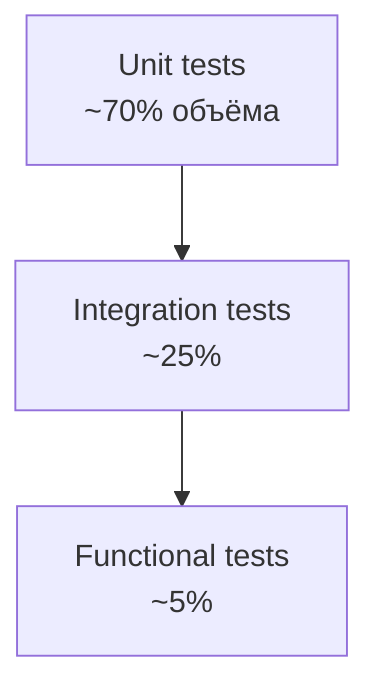

# 31. Testing strategy

## Стек

- PHPUnit 12.
- `symfony/browser-kit` + `symfony/css-selector` для functional.
- `symfony/phpunit-bridge` для интеграции.
- Playwright (`@playwright/test`) для browser smoke E2E admin-flow.
- (целевое) `infection/infection` для mutation testing.

## Пирамида



| Тип | Где | Что покрывает |
|---|---|---|
| Unit | `tests/Unit/<Module>/...` | Domain entities, enums, value objects, application handlers с моками |
| Integration | `tests/Integration/<Module>/...` | Doctrine repositories на тестовой БД, listeners, subscribers |
| Functional | `tests/Functional/<Module>/...` | HTTP контроллеры через `WebTestCase` |
| E2E сценарии | `tests/E2E/...`, `tests/e2e/...` | ручные чек-листы + browser smoke/regression для admin runtime |
| Support | `tests/Support/...` | хелперы (`SchemaTestHelper`) |

## Naming

- Класс: `<UnderTest>Test`.
- Метод: `test<Behaviour>` или `it_<does_thing>` (snake-style — допустимо, но единообразно).
- Покрывайте «happy path», «edge case», «failure case».

## Структура папок

```text
tests/
├── Unit/
│   ├── Content/PageTest.php
│   ├── Auth/Infrastructure/Security/AdminPermissionVoterTest.php
│   ├── Settings/Application/Service/SettingsServiceTest.php
│   └── Shared/Logging/PiiRedactorProcessorTest.php
├── Integration/
│   └── Content/DoctrineContentRepositoryTest.php
├── Functional/
│   ├── HealthCheckTest.php
│   ├── AdminLoginTest.php
│   ├── Content/AdminContentApiTest.php
│   ├── Seo/{Robots,Sitemap,Redirect}ControllerTest.php
│   └── Security/SecurityHeadersTest.php
├── Support/
│   └── Database/SchemaTestHelper.php
└── bootstrap.php
```

## Test database

В `phpunit.xml` (или через `.env.test`):

- `DATABASE_URL` — отдельная БД.
- Локальный PHPUnit запускается только против PostgreSQL service `postgres` из Docker Compose.
- SQLite (`sqlite://...`) запрещён для агентов и локальных quality-прогонов.
- В CI — Postgres-сервис (`.env.test.ci` подменяет `.env.test.local`).

## Schema setup

`SchemaTestHelper`:

- На старте functional/integration теста удаляет/создаёт схему и применяет миграции.
- В Postgres — `dropDatabase()` тяжело; вместо этого — truncate + `migrations:migrate --allow-no-migration`.

## Fixtures

В проекте `doctrine/doctrine-fixtures-bundle` пока **не подключён**. Использовать:

- builder’ы (`PageBuilder::default()->withPath('/abc')->build()`) — целевое, чисто Domain.
- Прямой `entityManager->persist()` в тесте.

## Mocking

| Можно мокать | Нельзя мокать |
|---|---|
| `*RepositoryInterface` | `EntityManagerInterface` |
| `LoggerInterface` | Doctrine `Connection` |
| `MessageBusInterface` | `Page`, `PageBlock` (это value, легче создать) |
| `CacheInterface` | `Ulid` |
| `ClockInterface` (целевое) | `\DateTimeImmutable` |

PHPUnit `createMock`/`createStub` — для interface, не для конкретных классов.

## Что обязательно тестировать

- Все domain methods, меняющие state.
- Все enum методы.
- Все application handlers (с моками).
- Все controllers (functional на 200/4xx/5xx).
- Все voters/user checkers.
- Все subscribers.
- Migration smoke (через CI `migrations:status`).
- Все public Twig extensions (unit).

## Что НЕ нужно тестировать

- Тривиальные геттеры без логики (если есть бизнес-смысл — да).
- Symfony framework сам по себе.
- Сторонние библиотеки.
- DTO без логики (если конструктор не делает валидаций — нет).

## Smoke tests

Functional тесты на `/health`, `/sitemap.xml`, `/robots.txt`, `/admin/login` — обязательны. После любых изменений infrastructure они должны проходить.

Для admin runtime дополнительно обязательны regression smoke-пути:

- `/admin/pages` -> `/admin/pages/{id}` -> `/admin/pages/{id}/builder`;
- builder save/reorder/rich-text update;
- preview-link generation для страницы.
- negative API contract smoke: невалидный payload возвращает `422` с validation details.

Текущий Playwright слой организован через helper-модули:

- `tests/e2e/helpers/admin.ts` — login + API mutations + runtime assertions;
- `tests/e2e/helpers/selectors.ts` — централизованные UI selectors/labels;
- `tests/e2e/helpers/fixtures.ts` — генерация deterministic payloads.

## SEO tests (целевое)

- canonical присутствует на каждой публичной странице;
- robots в prod-конфиге не `Disallow: /`;
- sitemap содержит published без drafts;
- 301 при смене path.

## Запуск

```bash
vendor/bin/phpunit
make test
make smoke          # release-readiness smoke checks
make quality        # validate + syntax + cs + phpstan + rector + schema/lint + phpunit + smoke + npm build
npm run typecheck
npm run test:frontend
npm run lint:admin
npm run test:e2e:smoke
```

В CI — `composer test` (см. composer.json scripts).

Для полного локального прогона качества:

```bash
make up
make test-db
make quality
npm run test:frontend
```

## Что проверять перед merge

- [ ] `composer check:syntax` ok.
- [ ] `composer check:cs` ok.
- [ ] `composer check:phpstan` ok.
- [ ] `composer check:rector` ok.
- [ ] `composer test` ok.
- [ ] Schema validate ok.
- [ ] `lint:container`, `lint:twig` ok.
- [ ] `php bin/console app:smoke:test` ok.
- [ ] `npm run typecheck` ok.
- [ ] `npm run test:frontend` ok.
- [ ] `npm run lint:admin` ok.
- [ ] `npm run test:e2e:smoke` ok.
- [ ] `npm run build` ok.
- [ ] `npm run check:chunks` ok.

## Что проверять при новой фиче

- [ ] Unit-тест на domain entity / enum / value object.
- [ ] Unit-тест на application handler.
- [ ] Integration-тест на repository, если новый.
- [ ] Functional-тест на новый endpoint (200 + edge-cases 401/403/404/422).
- [ ] Subscriber/listener покрыт тестом.
- [ ] Logging покрыт (если критично).
- [ ] Edge case: empty input, big input, invalid input.

## Anti-patterns

- Тесты, проверяющие имена методов через рефлексию.
- Тесты, читающие prod-БД.
- Тесты, делающие сетевые запросы наружу.
- Тесты, зависящие от текущего времени без `ClockInterface` мока.
- 1000-строчный test class на всё подряд.
- Тесты, которые проходят локально и ломаются в CI без ясного reason (timezone, locale).

## Связанные документы

- [09-application-layer](09-application-layer.md)
- [10-domain-layer](10-domain-layer.md)
- [11-infrastructure-layer](11-infrastructure-layer.md)
- [38-coding-standards](38-coding-standards.md)
- [38-coding-standards](38-coding-standards.md)
