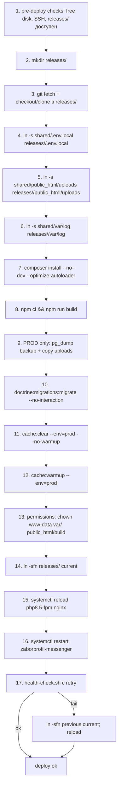

# 34. Deployment

См. также [DEPLOY.md](legacy/DEPLOY.md), [STAGING.md](legacy/STAGING.md), [PRODUCTION.md](legacy/PRODUCTION.md), [ADR-0009](adr/0009-vps-deployment-strategy.md).

> Staging и production деплоятся **на VPS без Docker**. Docker — только для local dev.

## Release layout

```text
/var/www/zaborprofil/
├── releases/
│   ├── 20260501-120000/
│   ├── 20260501-150000/
│   └── 20260502-090000/
├── shared/
│   ├── .env.local                 # APP_SECRET, DB password, Redis password, ...
│   ├── public_html/uploads/       # симлинкается из releases/<ts>/public_html/uploads
│   ├── var/log/                   # симлинкается из releases/<ts>/var/log
│   └── backups/                   # дампы PostgreSQL, копии uploads
└── current -> releases/20260502-090000
```

`current` — symlink. Атомарное переключение делает релиз. Старые `releases/<...>` сохраняются для быстрого rollback.

## Серверные компоненты

| Компонент | Версия | Источник |
|---|---|---|
| Nginx | ≥ 1.30.0 | пакеты Debian/Ubuntu |
| PHP-FPM | ≥ 8.5 | `ondrej/php` или системный 8.5 |
| PostgreSQL | ≥ 18 | apt PostgreSQL repository |
| Redis | ≥ 8 | apt |
| systemd | как ОС | управляет php-fpm, nginx, postgres, redis, messenger worker |
| TLS | Let’s Encrypt / certbot | автоматическое продление |
| Composer | 2.x | глобально |
| Node.js | 25.9.0 | nvm / nodesource (для `npm ci` во время deploy) |

## Скрипты

`tools/deploy/`:

- `common.sh` — общие функции, переменные.
- `deploy-staging.sh` — деплой staging.
- `deploy-production.sh` — деплой production (требует `CONFIRM_STAGING_DEPLOYED=yes`).
- `rollback.sh` — переключение `current` на предыдущий релиз.
- `health-check.sh` — curl healthcheck с retry.
- `shared-env-example.sh` — шаблон env переменных скриптов.
- `templates/nginx-staging.conf`, `nginx-production.conf` — nginx vhost.
- `templates/zaborprofil-messenger.service`, `zaborprofil-messenger-staging.service` — systemd unit для worker.

Все скрипты — bash, идемпотентны, логируют через `set -euo pipefail`.

## Порядок релиза



## Запуск вручную

Staging:

```bash
BRANCH=staging \
APP_ROOT=/var/www/zaborprofil \
HEALTH_URL=https://staging.zaborprofil.ru/health \
tools/deploy/deploy-staging.sh
```

Production:

```bash
CONFIRM_STAGING_DEPLOYED=yes \
BRANCH=master \
APP_ROOT=/var/www/zaborprofil \
HEALTH_URL=https://zaborprofil.ru/health \
tools/deploy/deploy-production.sh
```

Rollback:

```bash
HEALTH_URL=https://zaborprofil.ru/health tools/deploy/rollback.sh
```

## Nginx config

`tools/deploy/templates/nginx-production.conf`:

- `root /var/www/zaborprofil/current/public_html;`
- `index index.php;`
- `try_files $uri /index.php$is_args$args;`
- FastCGI на php-fpm socket.
- TLS termination.
- `Cache-Control` для `/build/*` и `/uploads/*`.
- Запрет `.php` исполнения внутри `/uploads/`.
- Healthcheck `/health` без access_log.

## PHP-FPM

- `pm = dynamic`, `pm.max_children` под нагрузку.
- `php.ini`: `memory_limit = 256M`, `max_execution_time = 60`, `date.timezone = Europe/Moscow`.
- OPcache: `opcache.memory_consumption = 256`, `opcache.preload = false` (или preload script — целевое).

## PostgreSQL

- Dedicated user `zaborprofil` с минимальными правами на одну БД.
- `listen_addresses = 'localhost'`.
- `pg_hba.conf` — `local` + `host 127.0.0.1/32` для приложения.
- WAL архивирование — целевое для PITR.

## Redis

- `bind 127.0.0.1`, `requirepass`.
- `appendonly yes`.
- `maxmemory` + `maxmemory-policy allkeys-lru` (для cache роли).

## systemd

`/etc/systemd/system/zaborprofil-messenger.service`:

```ini
[Service]
ExecStart=/usr/bin/php /var/www/zaborprofil/current/bin/console messenger:consume async failed --time-limit=3600 --memory-limit=128M
Restart=always
User=www-data
Group=www-data
```

`systemctl enable --now zaborprofil-messenger`.

## Cron / systemd timers (целевое)

- `app:seo:audit` — раз в сутки.
- `app:cache:warmup` — после каждого деплоя (уже в release script).
- `app:media:cleanup-orphans` — раз в неделю.
- `pg_dump` через `tools/deploy/` или отдельный backup script — ежедневно.

## Permissions

- Владелец release-папки — deploy user (например, `deploy`).
- `var/`, `public_html/build/`, `public_html/uploads/` — `chown -R www-data:www-data` после composer install.
- `chmod 750` на shared, `chmod 640` на `.env.local`.

## Cache warmup

```bash
php bin/console cache:clear --env=prod --no-warmup
php bin/console cache:warmup --env=prod
```

Делается в release-script после миграций, до переключения `current`.

## OPcache reset

После переключения `current` — `systemctl reload php8.5-fpm` сбрасывает OPcache (или используем `opcache_reset()` через console). Без этого OPcache держит старые `.php` пути.

## Zero / minimal downtime

- `current` symlink switch — атомарен (`ln -sfn` через временный symlink + `mv`).
- `systemctl reload` (graceful) → существующие запросы дорабатывают, новые — на новый код.
- Долгие миграции — стараться не делать в окно деплоя; staged migration см. [18-migrations](18-migrations.md).

## Rollback

1. `tools/deploy/rollback.sh` — переключает `current` на предпоследний release.
2. `systemctl reload php8.5-fpm nginx`.
3. `systemctl restart zaborprofil-messenger`.
4. `health-check.sh`.
5. Если миграция повредила БД — restore из backup (см. [36-backup-restore](36-backup-restore.md)).

## Deployment checklist

Перед prod deploy:

- [ ] Staging deploy прошёл.
- [ ] CI зелёный на той же SHA.
- [ ] Backup actual (pg_dump < 1ч).
- [ ] Disk free > 20%.
- [ ] Free RAM > 30%.
- [ ] Migrations прорепетированы на staging.
- [ ] Нет ALTER TABLE на больших таблицах в окно (или используется CONCURRENTLY).
- [ ] План rollback сформулирован.
- [ ] Stakeholder уведомлён.
- [ ] Логи Telegram — мониторим в окне деплоя.

После deploy:

- [ ] `/health` отдаёт 200.
- [ ] `/sitemap.xml` отдаётся.
- [ ] Логин в админку работает.
- [ ] Создание/публикация страницы работает (smoke).
- [ ] Логи без ERROR в первые 5 минут.

## Связанные документы

- [27-config-and-env](27-config-and-env.md)
- [29-healthchecks](29-healthchecks.md)
- [35-cicd](35-cicd.md)
- [36-backup-restore](36-backup-restore.md)
- [37-runbooks](37-runbooks.md)
- [DEPLOY.md](legacy/DEPLOY.md)
- [STAGING.md](legacy/STAGING.md)
- [PRODUCTION.md](legacy/PRODUCTION.md)
