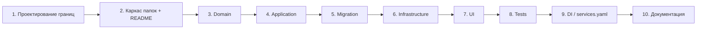
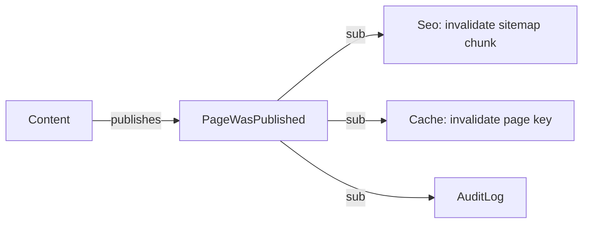

# 43. Module development guide

## Когда нужен новый модуль

- Появляется новый bounded context (Lead, Catalog, Partner).
- Существующий модуль слишком вырастает и хочет разделиться.
- Нужно изолировать сторонюю интеграцию с собственной моделью.

**Когда НЕ нужен новый модуль:**

- Хочется поделиться утилитой → Shared.
- Это просто новый use case существующей сущности → расширить модуль.
- Хочется «красиво структурировать» — не повод плодить bounded contexts.

## Шаги



## 1. Проектирование границ

- Какой aggregate root у модуля?
- Какие сущности владеет, а какие — только читает (через interface) у других модулей?
- Какие events публикует?
- Какой публичный язык (Repository interfaces, Application handlers, Events)?

## 2. Каркас

```text
src/Module/<Name>/
├── README.md
├── Domain/
│   ├── Entity/
│   ├── Enum/
│   ├── Repository/
│   ├── Exception/
│   └── ...
├── Application/
│   ├── Command/
│   ├── DTO/
│   ├── Handler/
│   └── Service/
├── Infrastructure/
│   ├── Repository/
│   └── ...
└── UI/
    ├── Admin/
    ├── Web/
    └── ...
```

Не создавайте все папки сразу. Только то, что нужно сейчас.

`README.md` модуля обязателен:

- название и зачем;
- aggregate / сущности;
- какие интерфейсы публикует;
- какие admin/public роуты;
- какие миграции;
- какие тесты;
- ограничения и риски.

## 3. Domain

См. [10-domain-layer](10-domain-layer.md). Кратко:

- Entity с инвариантами.
- Repository interface.
- Enum / Value Object по необходимости.
- Domain exception.

## 4. Application

См. [09-application-layer](09-application-layer.md). Кратко:

- Command/Query DTO.
- Handler.
- Output DTO.

## 5. Migration

См. [18-migrations](18-migrations.md). Имена таблиц — с префиксом модуля: `lead_*`, `catalog_*`, `seo_*`.

## 6. Infrastructure

- Doctrine repository.
- Listeners/Subscribers модуля → `Infrastructure/Http`, `Infrastructure/Doctrine`.
- Voters → `Infrastructure/Security`.

## 7. UI

- Admin / Web / Api / Console — по необходимости.

## 8. Tests

- Unit на Domain.
- Unit на Handler.
- Integration на Repository.
- Functional на Controller.

## 9. DI / services.yaml

В `config/services.yaml`:

- alias’ы repository interface → конкретный Doctrine repository (или `#[AsAlias]` на репозитории).
- explicit configuration для контроллеров с параметрами (`$siteUrl`, `$environment`).
- Если есть Doctrine entity — она автоматически исключена из автозагрузки сервисов через wildcard `src/Module/*/Domain/Entity/`.

## 10. Документация

Минимум:

- `src/Module/<Name>/README.md`.
- `docs/MODULES.md` — обновить статус.
- `docs/05-domain-model.md` — добавить раздел.
- При архитектурных решениях — ADR.

## Как модуль общается с другими

- **Read через interface.** Если `Catalog` нужен `Page` — использует `PageRepositoryInterface` через DI.
- **Write через handler.** Никогда не пишите в чужой `Doctrine*Repository` напрямую.
- **Через события.** Целевое: domain events (`PageWasPublished`) подписчиками в других модулях.



## Циклические зависимости

Запрещены. Если кажется, что модуль A нужен B, а B нужен A:

- общий концепт переносится в `Shared`;
- или общение идёт через event bus;
- или один из модулей разделяется на части.

## Тестирование границ модуля

- Unit-тест handler не должен трогать Doctrine.
- Integration-тест репозитория не должен трогать application handlers других модулей.
- Functional — допустимо трогать всё, потому что это HTTP-уровень.

## Удаление модуля

См. [06-module-architecture](06-module-architecture.md). Staged process.

## Чек-лист нового модуля

- [ ] Каркас папок создан.
- [ ] `README.md` модуля написан.
- [ ] Domain / Application / Infrastructure / UI содержат только нужное.
- [ ] Repository interface в Domain.
- [ ] Doctrine repository implements interface.
- [ ] Миграция написана.
- [ ] Тесты Unit / Integration / Functional.
- [ ] `services.yaml` обновлён.
- [ ] `docs/MODULES.md` обновлён.
- [ ] `docs/05-domain-model.md` обновлён.
- [ ] CI зелёный.

## Связанные документы

- [06-module-architecture](06-module-architecture.md)
- [10-domain-layer](10-domain-layer.md)
- [09-application-layer](09-application-layer.md)
- [11-infrastructure-layer](11-infrastructure-layer.md)
- [42-feature-development-guide](42-feature-development-guide.md)
