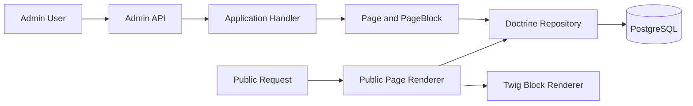

# Архитектура

Проект строится как модульный монолит на Symfony.

## Основные принципы

- Clean Architecture без бизнес-логики в контроллерах.
- Модули изолируют предметные области.
- Контроллеры принимают HTTP-запрос, вызывают application layer и возвращают response.
- Doctrine Entity используются как persistence model и не должны становиться god object.
- DTO, enum и value objects добавляются там, где появляется реальная бизнес-логика.

## Слои

- `Domain` — бизнес-правила, value objects, доменные события, исключения и контракты.
- `Application` — use cases, команды, запросы, DTO, валидаторы сценариев.
- `Infrastructure` — Doctrine, Redis, Mailer, Filesystem, Cache, внешние интеграции.
- `UI` — Web, Admin, API, CLI.

## Web root

В проекте используется `public_html/`, потому что OSPanel и будущий VPS должны отдавать именно этот каталог. Стандартный Symfony `public/` не используется.

## Текущие модули

- `Admin` — dashboard.
- `Auth` — вход в админ-панель.
- `User` — минимальная модель администратора.
- `Content` — Page/PageBlock, Admin API, публичный Twig renderer.
- Остальные модули зарезервированы README-файлами и будут реализованы по этапам.

## Content Engine

`Content` следует Clean Architecture:

- `Domain` содержит `Page`, `PageBlock`, enum и repository interfaces.
- `Application` содержит команды, handlers и DTO для сценариев.
- `Infrastructure` содержит Doctrine repositories.
- `UI` содержит Admin API и публичный renderer.

Публичный catch-all route имеет низкий priority и открывает только опубликованные страницы по `Page.path`. Черновики и архивные страницы возвращают `404`.

### Поток Публикации

### Правила Публичного Рендера

- Страница ищется по нормализованному `Page.path`.
- Показывается только `PageStatus::Published`.
- `PageBlock` выводятся по `position`.
- Отключенные блоки `is_enabled=false` не передаются в Twig renderer.
- Для неизвестного типа partial используется `templates/public/blocks/default.html.twig`.
