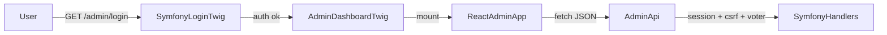

# ADR-0012: Admin = SSR-shell + React SPA-island, без полного SPA и без JWT

## Статус

Accepted, 2026.

## Контекст

Админка проекта использует гибридный паттерн:

- `/admin/login` и `/admin/logout` остаются серверными страницами Symfony Security.
- `/admin/*` после авторизации рендерится через Twig shell `templates/admin/dashboard.html.twig`.
- В shell монтируется клиентское приложение `assets/admin/app.ts` (React + TypeScript).
- Данные читаются и изменяются через `/admin/api/*` с CSRF, same-origin и voter-проверками.

## Решение

Фиксируем канонический подход:

1. **SSR только для точки входа админки** (`/admin/login`) и самого shell.
2. **React SPA-island** для интерактивной админки (`/admin/dashboard`, `/admin/content/*`, `/admin/settings/*`, и т.д.).
3. **Cookie-сессии Symfony** вместо JWT/refresh.
4. **Единый JSON API** `/admin/api/*` как контракт между UI и backend.
5. **CSRF через meta-теги Twig** + заголовок `X-CSRF-Token` в клиенте.

## Почему так

- Минимальная сложность безопасности: cookie-session + CSRF остаются нативными для Symfony.
- React нужен для сложного UX (редактор блоков, TipTap, модалки, интерактивные формы).
- Не создаём отдельный публичный SPA backend и не тащим JWT-инфраструктуру.
- Публичный сайт остаётся SSR на Twig и не превращается в SPA.

## Последствия

### Плюсы

- Ясная граница: public SSR и admin интерактивный SPA-layer.
- Сохраняется удобный DX для админки и типобезопасность TypeScript.
- API-контракты админки остаются пригодными для будущей автоматизации.

### Минусы

- Нужно поддерживать frontend toolchain (Vite, React, Vitest).
- Требуется дисциплина: бизнес-логика остаётся на backend, frontend только UI и orchestration.

## Риски и контроль

- Рост бандла админки: контролируем через регулярный `npm run build` и ревью зависимостей.
- Регрессии в редакторе: покрываем frontend unit-тестами и e2e-сценариями.
- Расхождение документации и кода: обновляем docs/ADR в том же PR, что и изменения стека.

## Когда пересматривать ADR

- Если понадобится отдельный внешне доступный admin API с другими клиентами (mobile/third-party).
- Если появится требование вынести админку на другой домен/поддомен.
- Если изменится базовый фронтенд-стек проекта.

## Связанные документы

- [12-admin-area.md](../12-admin-area.md)
- [22-frontend-assets.md](../22-frontend-assets.md)
- [20-security-and-access-control.md](../20-security-and-access-control.md)
